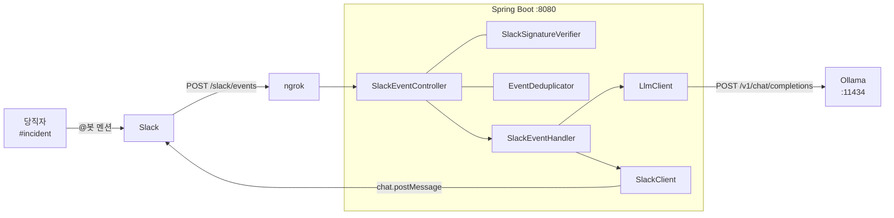
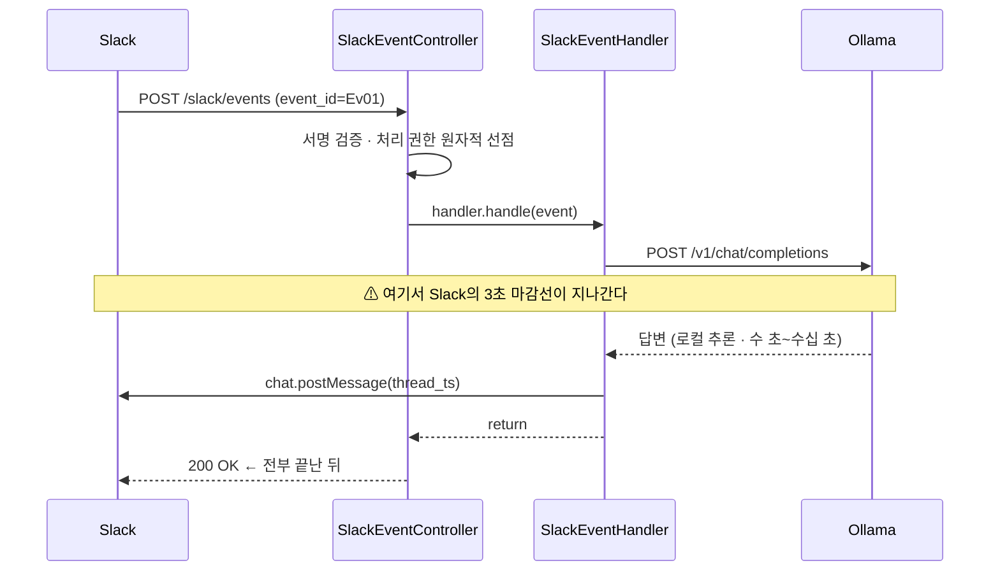
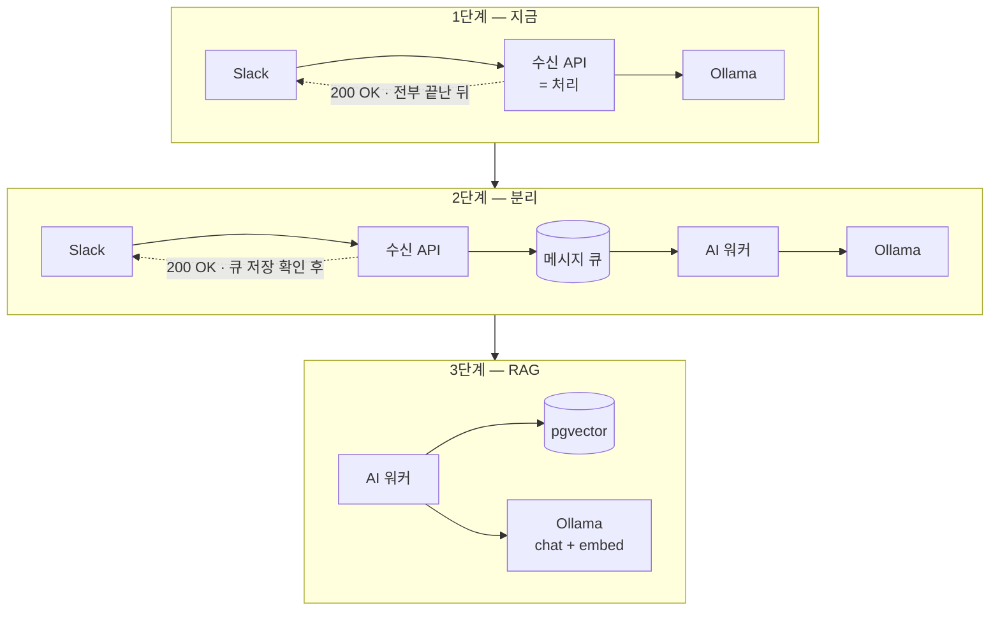

# ARCHITECTURE.md — slack-ai-lab

**목표 구조**와 그렇게 결정한 이유. 요구사항은 [`PRD.md`](PRD.md), 작업 규칙은 [`CLAUDE.md`](../../CLAUDE.md).

> 현재 코드는 없다. 이 문서는 앞으로 만들 구조를 기술한다.
> §7은 폐기한 프로토타입의 검증 기록이다. §8은 당시 결함에서 출발한 새 설계이며, 이 문서의 상태 전이·시간 제한·복구 정책은 아직 구현·검증 전이다.

---

## 1. 목표 구조 (1단계 · 동기)



프로세스는 하나. 외부 의존은 Slack과 Ollama뿐이다. 큐도 DB도 없다.

---

## 2. 컴포넌트 책임

| 패키지 | 클래스 | 책임 | 2단계에서 |
|---|---|---|---|
| `slack/` | `SlackEventController` | 수신 · 검증 · 분기 | 수신 서버에 남고 큐 저장 결과에 따라 응답 |
| | `SlackSignatureVerifier` | HMAC-SHA256 서명 검증 | 수신 서버에 남음 |
| | `SlackClient` | `chat.postMessage` 발신 | **워커로 이동** |
| `event/` | `SlackMessageEvent` | 페이로드 → 값 객체 | 큐 메시지 스키마가 됨 |
| | `EventDeduplicator` | `event_id` 중복 제거 | 워커의 공유 처리 상태로 확장 (§3.2) |
| | `SlackEventHandler` | LLM 호출 + 답글 | 워커에서 호출하며 처리 결과 계약을 확장 |
| `llm/` | `LlmClient` | 호출 경계 인터페이스 | RAG·LangGraph가 붙는 자리 |
| | `OpenAiCompatibleLlmClient` | Ollama 등 OpenAI 호환 호출 | 워커로 이동 |
| | `EchoLlmClient` | 모델 없이 왕복 검증용 더미 | 유지 |
| `config/` | `*Properties` | `record` + `@ConfigurationProperties` | 각자 따라 이동 |

### 절대 경계

**`SlackEventHandler`는 HTTP를 모른다.** `HttpServletRequest`도, 응답 코드도 들어오지 않는다.
업무 처리와 전송 계층을 분리하는 제약이다. P1의 재시도·복구를 위한 결과 타입과 호출부 변경은 허용한다.
핸들러는 성공·명확한 실패·전송 결과 불명을 반환하고, 컨트롤러 또는 워커가 HTTP 응답·큐 ACK를 결정한다.
`SENDING` 기록을 위해 핸들러가 상태 저장소 **인터페이스**(P0 `EventDeduplicator`, P1 `ProcessingStateStore`)에 의존하는 것은 허용한다. 금지 대상은 HTTP 타입이며, `jakarta.servlet`·`HttpStatus` import가 없는지 grep으로 검사한다.

---

## 3. 요청 흐름과 3초 제약



### Slack이 정한 제약

| 제약 | 내용 | 결과 |
|---|---|---|
| **3초 ACK** | 3초 안에 2xx를 못 받으면 같은 `event_id`로 재전송(Slack 문서상 최대 3회 — **미검증**, 실제 시점·횟수는 실험에서 관측해 `EXPERIMENT-LOG.md`에 기록) | 중복 실행 위험; §3.2로 억제 |
| 재전송 식별 | `X-Slack-Retry-Num`, `X-Slack-Retry-Reason` 헤더 | 로그로 관찰 가능 |
| 서명 검증 | `v0:{timestamp}:{raw body}` 를 HMAC-SHA256 | **raw body 필수** |
| 오류 표현 | 실패해도 HTTP 200. 본문 `ok: false` | 상태 코드만 보면 놓침 |
| URL 등록 | `url_verification` 요청의 `challenge`를 그대로 반환 | 서버가 떠 있어야 등록된다 |

동기 처리 시간이 3초를 넘으면 재전송이 발생하는 흐름을 관찰한다. 실제 추론이 빠르면 인위적 지연으로 재현한다.
재전송 발생과 중복 답글 발생은 별도 지표다. 중복 답글이 0이어도 실험은 성립한다.

---

### 3.1 HTTP 응답과 복구 책임

아래 값은 우리 수신 API의 정책이다. Slack 발신 API의 응답과 구분한다.

| 상황 | P0 수신 응답·책임 | P1 수신 응답·책임 |
|---|---|---|
| 서명 불일치·허용 시간 초과 | 401, 처리하지 않음 | 동일 |
| Signing Secret 등 필수 설정 누락 | 기동 실패로 차단 | 동일 |
| 서명은 유효하나 본문 형식이 잘못됨 | 400, 원인 로그 | 동일 |
| 유효한 URL 검증 | 200 + challenge | 동일 |
| 무시할 이벤트 | 200, LLM·발신 호출 없음 | 동일 |
| 유효한 새 이벤트 | 동기 처리 종료 후 200 | 큐의 내구성 있는 저장 확인 후에만 200 |
| 이미 처리 중·완료·결과 불명인 이벤트 | 200, §3.2에 따라 중복 실행 억제 | 기본적으로 큐 저장 후 200; 중복 처리는 워커에서 억제 |
| LLM 실패·시간 초과 | 안내 전송 1회 후 결과 기록, 200 | 수신 응답과 분리; 워커가 재시도·최종 안내·DLQ 관리 |
| Slack 발신 실패·결과 불명 | 상태와 로그 기록, 200; 자체 재시도 없음 | 워커가 명확한 실패와 결과 불명을 나눠 복구 |
| 큐 저장 실패·확인 시간 초과 | 해당 없음 | 503; 200으로 수락하지 않음. 저장됐을 가능성에 따른 중복은 워커가 억제 |
| 처리 권한 확보 전 내부 오류 | 500, 추적 로그 | 큐 저장 전이면 500/503; 저장 후 오류는 큐 복구 경로로 처리 |

P0의 200은 처리 성공이나 영속 보관을 뜻하지 않는다. 발신 실패 이후 재전송이 없으면 자동 복구되지 않는 학습 단계의 한계다.
P1은 수신 서버의 메모리에서 event_id를 봤다는 이유만으로 200을 반환하지 않는다. 큐 저장과 별도 dedup 기록을 비원자적으로 묶는 대신, 중복 큐 입력을 허용하고 워커에서 처리 권한을 선점한다.

### 3.2 중복 처리 상태와 전송 결과

키는 단일 워크스페이스의 `event_id`이며 `attempt_id`, 상태, 시작·종료 시각, 실패 단계와 확인된 Slack 메시지 식별자를 함께 기록한다.
`get` 후 `put`으로 선점하지 않는다. P0는 맵의 원자적 연산, P1은 공유 저장소의 조건부 갱신으로 소유자를 결정한다. 모든 상태 변경은 현재 `attempt_id` 소유자만 수행한다.

| 현재 상태 | 전이 조건 | 다음 상태·동작 |
|---|---|---|
| 없음 / 재시도 가능한 명확한 실패 | 처리 권한 원자적 선점 | `PROCESSING` |
| `PROCESSING` | 동일 이벤트 재수신 | 새 실행을 시작하지 않음 |
| `PROCESSING` | LLM 실패·제한 초과 | P0는 실패 안내를 전송 대상으로 선택; P1은 §5.1 재시도 정책 적용 |
| `PROCESSING` | 답변 또는 최종 실패 안내 전송 직전 | `SENDING`을 먼저 기록; 기록 실패 시 전송 금지 |
| `SENDING` | 전송 성공과 메시지 식별자 확인 | `COMPLETED`; 답변/실패 안내 종류도 기록 |
| `PROCESSING` / `SENDING` | 전송되지 않았음이 확실한 실패 | `FAILED`; P0는 이후 재전송, P1은 제한된 재시도 대상 |
| `SENDING` | 전송 여부를 확인할 수 없음 / 소유 워커 소실 | `UNKNOWN`; 자동 재발신 금지, 확인 대상으로 분리 |
| `COMPLETED` / `UNKNOWN` | 동일 이벤트 재수신 | 새 실행을 시작하지 않음 |

**P0**: `COMPLETED`와 `UNKNOWN`은 전이 시점부터 10분 유지한다. 실행 중인 엔트리를 일반 TTL 청소로 삭제하지 않는다. 처리 기한에 도달하면 발신 시작 여부에 따라 `FAILED` 또는 `UNKNOWN`으로 정리한다. 프로세스 재시작·보존 기간 이후에는 중복 억제를 보장하지 않는다.

**P1**: `PROCESSING`의 소유권은 30초 임대, 10초마다 갱신하는 초기 정책으로 둔다. 갱신 실패 시 새 발신을 금지한다. 임대 만료된 `PROCESSING`만 재선점할 수 있고, 만료된 `SENDING`은 반드시 `UNKNOWN`으로 보낸다. 이전 소유자의 상태 갱신은 거절한다. 공유 상태의 원자적 갱신으로 `SENDING`까지 진입해야 발신할 수 있다.

P1의 자동 재시도·재전달 허용 기간은 최초 수신부터 24시간이다. `COMPLETED`는 최소 7일 유지하고, 24시간이 지난 미완료 이벤트는 새 실행 대신 복구 대상으로 전환한다. `UNKNOWN`·미해결 DLQ는 시간 만료만으로 삭제하지 않는다. 이는 보장 범위를 제한하는 초기 운영 정책이며 변경 시 PRD와 실험 조건을 함께 갱신한다.

**전송과 상태 기록은 하나의 트랜잭션이 아니다.** Slack 전송 직후 프로세스가 죽으면 자동으로 정확히 한 번을 보장할 수 있다고 주장하지 않는다. `UNKNOWN`은 event_id, 채널, 스레드, 시도 시각으로 운영자가 실제 스레드를 확인한다. 기존 답글이 확인되면 식별자를 기록해 완료 처리하고, 확인할 수 없으면 자동 재전송하지 않는다. 기존 실행이 종료됐고 미전송임을 확인한 경우에만 수동 재처리를 승인한다. P0에서는 로그와 인메모리 상태로 확인하며, P1에서는 복구 상태를 영속 보관한다.

---

## 4. LLM 호출

### 벤더 중립 유지

```
LlmClient (interface)
  ├─ OpenAiCompatibleLlmClient   ← base-url만 바꾸면 벤더 교체
  │     · Ollama   http://localhost:11434/v1   (기본)
  │     · Groq     https://api.groq.com/openai/v1
  │     · OpenAI   https://api.openai.com/v1
  └─ EchoLlmClient               ← 모델 없이 Slack 왕복만 검증
```

Ollama가 OpenAI 호환 엔드포인트(`/v1/chat/completions`)를 제공하므로,
**요청/응답 스키마를 OpenAI 형태로 고정**하면 벤더가 설정값이 된다.
응답 파싱 경로는 `choices[0].message.content` 하나로 통일된다.

### 모델 선택 (P0 기준)

| 용도 | 후보 | 비고 |
|---|---|---|
| 채팅 (기본) | `qwen2.5:7b` | 한국어 준수, 범용 |
| 채팅 (한국어 강화) | `exaone3.5:7.8b` | 한국어 특화 |
| 채팅 (저사양) | `qwen2.5:3b` | 메모리 부족할 때 |
| 임베딩 (P2) | `bge-m3` | 다국어. 한국어 검색에 유리 |

### 로컬 추론이 강제하는 설계

| 사항 | 대응 |
|---|---|
| 첫 호출이 모델 적재로 크게 느리다 | `keep_alive`를 길게 잡아 상주시킨다. 기동 후 워밍업 호출 1회 |
| 답변 길이 = 응답 시간 | 시스템 프롬프트로 길이 제한 + `max_tokens`로 상한 |
| 응답이 수십 초까지 간다 | 연결·읽기 제한과 전체 호출 기한을 함께 적용한다 (§4.1) |
| 동시 요청 병렬화가 제한적 | 수신·큐 대기·추론·발신을 각각 측정해 병목을 판단한다 (§11) |

---

### 4.1 P0 처리 기한과 실패 안내

- 검증을 통과하고 처리 권한을 선점한 시점을 `t0`로 잡는다. LLM 단계 기한은 `t0 + 50초`, 전체 처리 기한은 `t0 + 60초`다. 시간 차이는 단조 시계로 계산한다.
- 인위적 지연, 연결 대기, 연결 수립, 응답 읽기를 모두 LLM 단계 50초에 포함한다. 각 호출은 남은 시간을 전달받으며, 연결 제한은 최대 3초와 남은 시간 중 작은 값이다.
- `read timeout`만으로 전체 제한을 구현했다고 간주하지 않는다. 구현의 첫 작업으로 스파이크를 돌려 조각 응답·연결 정체에서 요청이 실제로 끊기는지 확인한 뒤 방식을 확정한다(`PLAN.md` M1.5). 사용하는 HTTP 전송 계층이 전체 호출 기한과 진행 중 요청 취소를 지원하는지 구현 시 확인하고, 느린 응답·조각 응답·연결 정체로 검증한다. 인터럽트만 보내고 작업을 방치하는 구현은 허용하지 않는다.
- LLM이 실패하거나 50초 기한에 도달하면 호출을 취소하고 실패 안내를 선택한다. 늦게 반환된 LLM 결과는 폐기한다. 취소 요청이 Ollama 내부 추론 종료까지 보장한다고 가정하지 않으며, 잔여 추론의 영향은 별도 관측한다.
- 정상 답변 또는 실패 안내 중 하나만 전송한다. Slack 호출 기한은 `min(전송 시작 + 10초, t0 + 60초)`이며 연결 시간도 포함한다. 남은 시간이 없으면 새 발신을 시작하지 않는다.
- 답변 전송 실패 뒤 추가 안내를 연쇄 발신하지 않는다. 전송 실패가 명확하면 `FAILED`, 이미 전송됐을 가능성이 있으면 `UNKNOWN`으로 기록한다. 로그에는 event_id·attempt_id·실패 단계·오류 분류를 남긴다.
- MVC 수신 요청은 이 처리가 끝난 후 응답한다. 시간 제한을 구현하기 위해 내부 취소 장치를 쓰더라도 HTTP ACK를 먼저 보내는 구조로 바꾸지 않는다. 이 기한은 애플리케이션 처리 예산이며 OS 정지나 응답 패킷 도달 시간까지 보장하는 실시간 제약은 아니다.

P1에서도 워커 1회 시도에 이 예산을 적용한다. PRD의 답변 p95 30초는 큐 대기를 포함한 정상 부하의 성능 목표이며, 장애 시 복구 완료 기한과 구분한다.

---

## 5. 단계별 진화



| 단계 | 들어오는 것 | 바뀌는 파일 | 새로 생기는 문제 |
|---|---|---|---|
| 1 | — | — | 3초 초과 · 중복 답글 |
| 2 | 큐, 워커 | 컨트롤러·발행자·워커·상태 저장소·복구 정책 | 멱등성 · 재시도 · DLQ · 분산 dedup |
| 3 | 임베딩, Vector DB | `LlmClient` 주변 | 색인 갱신 · 검색 품질 |
| 4 | LangGraph, 멀티 모델 | 워커 내부 | 분기 관리 · 모델 라우팅 |
| 5 | n8n, 모니터링 | 수신 API에 엔드포인트 추가 | 입력 채널별 인증 |

### 5.1 P1의 변경 범위와 책임

아래 컴포넌트는 P1에서 도입한다. P0에 큐·분산 상태·재시도 프레임워크를 미리 구현하지 않는다.

| 컴포넌트 | 책임 |
|---|---|
| `SlackEventController` | 검증·필터링 후 발행 호출, 저장 확인 결과를 HTTP 응답으로 변환 |
| `EventPublisher` | event_id·최초 수신 시각·채널·스레드·입력·스키마 버전을 큐에 저장하고 내구성 있는 저장 확인을 반환 |
| `EventWorker` | 큐 소비, 처리 권한 선점, 핸들러 호출, 결과 분류, 완료 기록 뒤 ACK |
| `ProcessingStateStore` | 소유권·임대·상태 전이·보존 기간을 원자적으로 관리; P0 인메모리 dedup을 대체 |
| `SlackEventHandler` | HTTP·큐 ACK와 무관한 업무 처리; 발신 결과와 실패 단계를 반환하도록 확장 |
| `RetryPolicy` / `RecoveryService` | 재시도 예약·최종 안내·DLQ·UNKNOWN 확인 및 수동 복구 |

- 초기 재시도 정책은 최초 시도 이후 최대 3회, 기본 대기 5초·30초·120초다. 적용 가능한 서버 지정 대기 시간이 있으면 그보다 일찍 재시도하지 않는다. 최초 수신 후 24시간을 넘으면 자동 실행을 멈추고 복구 대상으로 넘긴다.
- LLM 일시 실패와 미전송이 확실한 일시적 발신 실패만 자동 재시도한다. 인증·권한·잘못된 입력 등 영구 오류와 전송 결과 불명은 반복 호출하지 않는다. 오류 분류는 각 클라이언트 경계에서 수행한다.
- LLM 재시도를 소진하면 최종 실패 안내를 1회 시도한다. 안내 성공은 `COMPLETED(kind=failure_notice)`로 기록하되 정상 답변 성공 지표에는 포함하지 않는다. 안내의 명확한 실패는 DLQ, 결과 불명은 복구 상태로 남긴다.
- 성공은 상태 저장 후 큐 ACK한다. 재시도는 다음 실행 예약의 영속 저장 확인 후 ACK한다. DLQ·복구 대상도 영속 저장을 확인한 뒤 ACK한다. 저장 실패 시 ACK하지 않는다.
- 재시도 예약과 ACK 사이에서 죽어 중복 전달되더라도 event_id와 시도 세대로 하나만 실행한다. 다른 워커가 `PROCESSING`이면 지연 재확인하고 완료 기록 없이 소비를 끝내지 않는다. `SENDING` 소유권 만료는 자동 재실행이 아니라 `UNKNOWN` 복구로 전환한다.
- 큐·공유 상태 저장소의 내구성 설정, 상태 갱신의 원자성, 미확인 메시지 재전달, 재시도 예약은 P1에서 제품을 선택할 때 검증한다. 단순 publish 호출 반환만으로 내구성이 확보됐다고 가정하지 않는다.

---

## 6. 결정 기록

### ADR-1 · Socket Mode 대신 Events API (HTTP)

Socket Mode를 쓰면 공개 URL 없이 WebSocket으로 받을 수 있어 로컬 개발이 편하다. 그럼에도 HTTP:

- **3초 ACK 제약을 직접 겪는 것이 1단계의 목표**인데, Socket Mode는 그 체감을 흐린다
- 2단계 이후 구조(수신 API → 큐 → 워커)가 HTTP 기준이다
- 대가: ngrok이 필요하고, 재시작마다 URL이 바뀐다

### ADR-2 · 1단계는 일부러 동기로 둔다

큐를 처음부터 넣으면 "왜 필요한가"를 설명할 근거가 없다.
동기로 만들어 깨지는 것을 관찰하고, 그 데이터로 2단계를 정당화한다.
WebFlux도 같은 이유로 쓰지 않는다 — 비동기로 감추면 제약이 안 보인다.

### ADR-3 · 로컬 추론(Ollama) + OpenAI 호환 스키마

- 비용 0원이 요구사항 ([`PRD.md`](PRD.md) §5)
- 대화 내용이 외부로 나가지 않는다
- 3단계 임베딩 모델을 같은 런타임에서 돌릴 수 있다 → 멀티 모델 실습이 공짜
- **느린 것이 1단계에서는 이득이다**
- 호출 스키마를 OpenAI 호환으로 고정해 벤더 종속을 피한다

### ADR-4 · dedup은 한시적으로 인메모리

`ConcurrentHashMap` + TTL. 재시작하면 날아가고, 인스턴스가 늘면 깨진다.
**알고 쓰는 부채**다. P1-8에서 Redis로 교체한다.
P0부터 원자적 선점과 처리·발신·완료·결과 불명 상태를 구분한다 (§3.2). P1에서 워커가 공유 상태를 소유한다.

### ADR-5 · 워커 언어는 아직 정하지 않는다

LangGraph는 Python 생태계다.

| 안 | 장점 | 단점 |
|---|---|---|
| 워커만 Python | 큐를 경계로 언어 분리 — MSA 관점에서 자연스럽다 | 운영 대상이 둘로 늘어난다 |
| 전부 Java (Spring AI) | 익숙하다. 배포가 단순하다 | LangGraph 레퍼런스를 못 쓴다 |

P1 착수 직전에 정한다. 그 전까지는 어느 쪽이든 되도록 `SlackEventHandler`를 HTTP에서 떼어 둔다.

### ADR-6 · 프로토타입은 폐기하고 지식만 승계한다

문서 없이 먼저 만든 프로토타입이 있었다. `./gradlew build` · `bootRun` · `/health`까지 통과했지만,
설계 근거가 코드보다 늦게 나왔다는 점이 문제였다. 코드는 버리고 **검증된 사실만 §7·§8로 옮긴다.**
새 코드는 이 문서와 `PLAN.md`에서 다시 만든다. 이전 저장소에 의존하지 않는다.

### ADR-7 · 인위적 지연 스위치는 그대로 둔다

Ollama가 느려서 3초 초과는 저절로 재현된다. 그래도 `experiment.slow-mode-ms`는 유지한다 —
**재현 가능한 고정 지연**이 있어야 "3.0초 vs 2.5초" 같은 경계 실험을 할 수 있다.

---

## 7. 검증된 기술 선택 (프로토타입에서 확인됨)

폐기한 프로토타입에서 **실제로 통과한 것**만 적는다. 새로 만들 때 이 조합에서 출발하면 초기 삽질이 없다.

### 통과한 것

| 항목 | 값 | 어디까지 확인됐나 |
|---|---|---|
| JDK | 21 (toolchain) | 컴파일·기동 |
| Spring Boot | 3.4.1 | 의존성 해석·컨텍스트 기동 |
| Gradle Wrapper | 8.14.3 | 플러그인 호환 확인 |
| 의존성 | `starter-web`, `starter-validation`, `configuration-processor`, `lombok`, `starter-test`, `junit-platform-launcher` | 전부 해석됨 |
| 설정 바인딩 | `record` + `@ConfigurationProperties` + `@ConfigurationPropertiesScan` | 컨텍스트 기동 성공 |
| 〃 | 컴팩트 생성자에서 기본값 대입 | 동작 |
| 〃 | 빈 문자열·`${VAR:0}` 형태 primitive 바인딩 | 동작 |
| HTTP 클라이언트 | `RestClient.Builder` 주입 (`@Component`와 `@Bean` 양쪽) | 동작 |
| 조건부 빈 | `@Bean` 메서드 안에서 분기해 구현체 선택 | 동작 |
| 서명 검증 | `v0:{ts}:{rawBody}` HMAC-SHA256, `HexFormat`, `MessageDigest.isEqual` | **단위 테스트 4건 통과** |
| Lombok | `compileOnly` + `annotationProcessor` 양쪽 선언 | 필수. 한쪽만 쓰면 컴파일 실패 |
| 서버 | 내장 톰캣 8080, `@RestController` 매핑 | `/health` 응답 확인 |

### 확인 안 된 것 (새로 만들 때 여기서부터 실증 필요)

- 실제 Slack 요청에 대한 서명 검증 (단위 테스트는 자체 생성 서명으로만 검증됨)
- `url_verification` challenge 왕복
- `chat.postMessage` 실호출과 `ok:false` 처리
- LLM 실호출 — 프로토타입은 **존재하지 않는 모델 ID**가 박혀 있었다
- 3초 초과 재전송 동작

> **교훈**: "빌드가 통과했다"는 외부 연동이 된다는 뜻이 아니다.
> `PLAN.md`에는 정상 흐름의 **외부 왕복 성공**과 오류 유도 시 기대한 응답·상태·로그 확인을 각각 완료 기준으로 적는다.

---

## 8. 처음부터 피할 설계 함정

프로토타입에서 실제로 심었던 결함들이다. **이번에는 처음부터 이렇게 만든다.**

| # | 함정 | 잘못된 방식 | 이번 방식 |
|---|---|---|---|
| 1 | **dedup 확정 시점** | 처리 **전에** `event_id`를 "봤음"으로 확정 → 처리 중 실패하면 재전송도 버려져 **답글이 영영 안 감** | 원자적 선점 후 §3.2 상태 전이 적용. 전송 확인 후 완료하고, 결과 불명은 자동 재발신하지 않는다 |
| 2 | **발신 실패가 500으로 누출** | `chat.postMessage` 실패 시 예외가 컨트롤러 밖으로 → Slack에 500 → 재전송 → 또 실패 루프 | 클라이언트·핸들러가 오류를 분류하고, HTTP 응답은 §3.1, 워커 복구는 §5.1을 따른다 |
| 3 | **조용한 실패** | LLM 실패 시 스레드에 아무것도 안 달림 | 남은 예산 안에서 안내 1회 시도. 안내 전송 실패·결과 불명도 상태와 로그로 남긴다 (P0-6) |
| 4 | **봇 자기 메시지 루프** | `bot_id`/`subtype` 미필터 시 봇이 자기 답글에 또 답함 | 값 객체 단계에서 `shouldIgnore()`로 차단 |
| 5 | **raw body 훼손** | DTO로 파싱 후 재직렬화하면 공백·필드 순서가 달라져 서명이 깨짐 | 컨트롤러가 `@RequestBody String`으로 받고, 검증 후에 파싱 |
| 6 | **타임아웃 미설정** | 기본 타임아웃이 사실상 무제한 / 또는 너무 짧아 로컬 추론을 끊음 | §4.1의 전체 처리 기한·호출 취소·늦은 결과 폐기를 적용한다 |
| 7 | **벤더 종속** | 특정 벤더 전용 스키마를 클라이언트에 박음 | OpenAI 호환 스키마 고정, 교체는 `llm.base-url` |
| 8 | **모델 ID 추측** | 검증 없이 모델 문자열을 설정에 박아 첫 호출에서 404 | `ollama list` 결과를 그대로 쓰고, 기동 시 모델 존재를 확인한다 |
| 9 | **스레드 문맥 없음** | 되물으면 앞 대화를 모름 | 1단계는 의도적으로 없음. P1-6에서 추가 |
| 10 | **답변 길이 무제한** | 긴 답변이 응답 시간을 키우고 전송에서 잘릴 수 있음 | 시스템 프롬프트 + `max_tokens`로 상한을 건다 |

1·2·3번은 **1단계에서 바로 지킨다.** 9번은 일부러 미룬다.

---

## 9. 데이터

1단계에 저장소는 없다. `EventDeduplicator`의 인메모리 맵이 전부다.

| 저장소 | 담는 것 | 후보 | 단계 |
|---|---|---|---|
| 처리 상태 | `event_id`·시도 소유자·상태·기한·확인된 메시지 식별자 (§3.2) | 인메모리 → Redis | 1 → P1 |
| 큐 | 처리 대기 이벤트 | Redis Streams / RabbitMQ | P1 |
| 문서 + 벡터 | 과거 장애 리포트와 임베딩 | PostgreSQL + pgvector | P2 |

P1의 큐·재시도·DLQ에는 복구에 필요한 입력을 일시 보관한다. 완료·복구 종료 후 입력을 삭제하고, 보존 기간 동안 중복 억제용 메타데이터만 유지한다. 미해결 건은 운영자가 주기적으로 검토한다. 대화 내용의 **영구 아카이브는 만들지 않는다** ([`PRD.md`](PRD.md) §7).

---

## 10. 보안

- **모든 요청 서명 검증.** Signing Secret이 비어 있으면 전부 거부한다 (열어두지 않는다)
- 타임스탬프 5분 초과 거부 — 리플레이 방지
- 서명 비교는 상수 시간 (`MessageDigest.isEqual`) — `equals()` 금지
- 토큰·시크릿은 환경변수. `.env`는 커밋하지 않는다
- ngrok URL은 공개된 주소다. **서명 검증이 유일한 방어선**이라는 것을 잊지 않는다
- 로컬 추론이므로 대화 내용이 외부 API로 나가지 않는다


## 11. 계측과 검증

병목을 미리 정하지 않는다. PRD §5의 고정 장비·모델·토큰 상한·워커 수·부하 조건을 실험 기록에 남기고 아래 지표를 수집한다.

| 측정값 | 시작 → 종료 | 목적 |
|---|---|---|
| 수신 응답 시간 | 서버 HTTP 진입 → 응답 완료 | P1 p95 200ms 목표; 큐 저장 확인 포함 |
| 큐 저장 시간 | 발행 시작 → 내구성 확인 | 큐·네트워크 지연 분리 |
| 큐 대기 시간 | 큐 저장 시각 → 워커 처리 시작 | 적체·재시도 대기 확인 |
| LLM 시간 | 호출 시작 → 성공·실패·취소 | 연결·추론 지연과 실패 분류 |
| 발신 시간 | Slack 호출 시작 → 성공·실패·결과 불명 | 발신 지연과 불확실성 분류 |
| 답변 시간 | 최초 서버 수신 → 정상 답변 발신 성공 확인 | 큐 대기·재시도 포함, P1 p95 30초 목표 |

로그는 `event_id`, `attempt_id`, 단계, 결과, 소요 시간, 최초 수신 시각, 재전송 헤더를 포함한다. 프롬프트·본문·토큰·시크릿은 관측 로그에 남기지 않는다. event_id는 로그 상관관계에만 쓰고 메트릭 라벨로 쓰지 않는다.
프로세스 내부 소요 시간은 단조 시계로, 프로세스 간 구간은 동기화된 UTC 시각으로 계산한다. 음수 구간이나 시계 오차가 보이면 해당 실험을 유효한 성능 측정으로 판정하지 않는다.

- 성능 실험은 서로 다른 이벤트 10건 동시 전송 × 10배치, 총 100건이다. 각 지표의 표본을 정렬해 `ceil(0.95 × N)`번째 값을 p95로 사용한다. 정상 답변 외 실패·누락을 제외해 합격시키지 않는다. 유실·실패·중복 답글이 한 건이라도 있으면 PRD 성능 기준 미달이다.
- 동일 이벤트 동시 전달·완료 후 재전달은 별도 실험이며 중복 수신 수, 억제 수, 실제 답글 수를 비교한다. 안내 메시지는 정상 답변과 구분한다.
- 서명 거부, LLM 제한 초과, 안내 전송 실패, 큐 저장 실패를 각각 유도하고 HTTP 응답·상태·로그를 확인한다. 전체 시간 제한은 연결 정체와 느린 응답에서도 검증한다.
- 큐 저장 후 수신 서버 중단, 워커 처리 중 중단, 발신 성공 직후 완료 기록 전 중단을 각각 유도한다. 마지막 경우는 `UNKNOWN`으로 남고 자동 중복 발신 없이 수동 확인·복구까지 가능한지 확인한다.
- 위 항목은 구현 후 수행할 검증 계획이다. 현재 통과한 결과로 취급하지 않으며 결과는 루트 기준 `docs/EXPERIMENT-LOG.md`에 남긴다.
