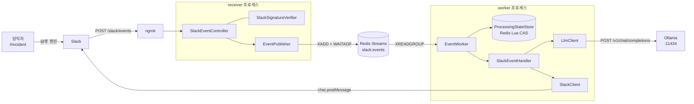
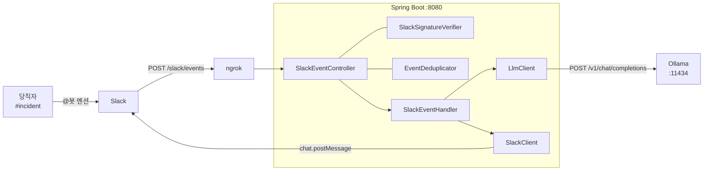
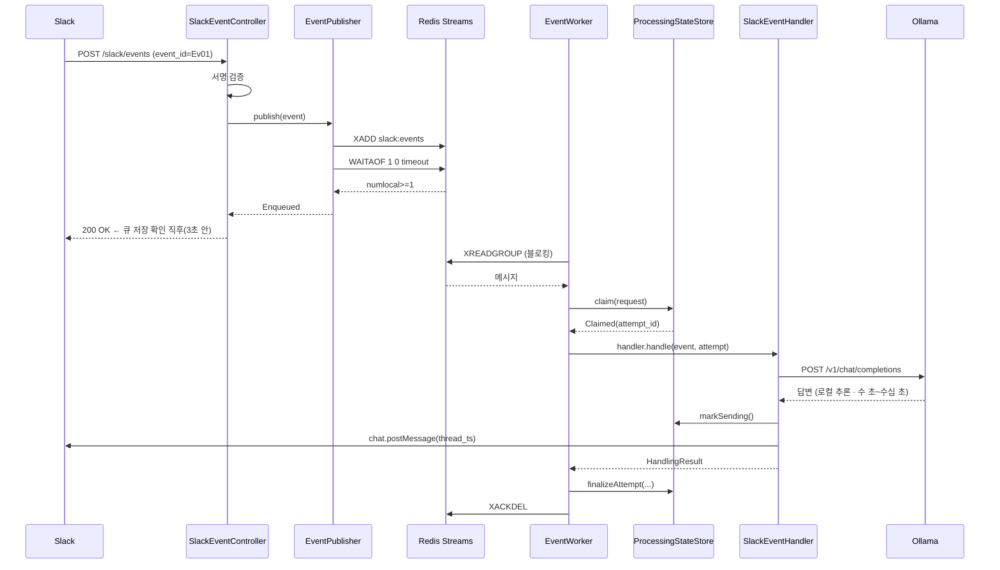
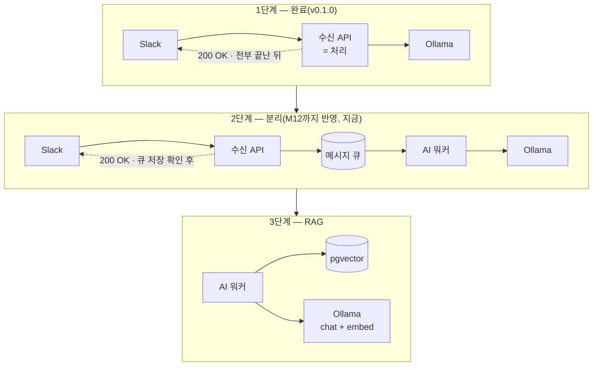

# ARCHITECTURE.md — slack-ai-lab

**목표 구조**와 그렇게 결정한 이유. 요구사항은 [`PRD.md`](PRD.md), 작업 규칙은 [`AGENTS.md`](../../AGENTS.md).

> 1단계는 `v0.1.0`으로 완료했다. 2단계는 M9~M11까지 진행했고, **M12(수신–큐–워커 분리)까지 실제 구조로 반영됐다**
> (아래 §1). §7은 폐기한 프로토타입의 검증 기록이다. §8은 당시 결함에서 출발한 설계이며, 표시된 항목은 구현·검증됐다.

---

## 1. 현재 구조 (2단계 · 수신–큐–워커 분리, M12)


```mermaid
flowchart LR
    U["당직자<br/>#incident"] -->|"@봇 멘션"| SL[Slack]
    SL -->|"POST /slack/events"| NG[ngrok]
    NG --> C

    subgraph RECEIVER["receiver 프로세스"]
        C[SlackEventController]
        V[SlackSignatureVerifier]
        P[EventPublisher]
        C --- V
        C --> P
    end

    P -->|"XADD + WAITAOF"| RS[(Redis Streams<br/>slack:events)]

    subgraph WORKER["worker 프로세스"]
        W[EventWorker]
        ST[(ProcessingStateStore<br/>Redis Lua CAS)]
        H[SlackEventHandler]
        L[LlmClient]
        K[SlackClient]
        W --> ST
        W --> H
        H --> L
        H --> K
    end

    RS -->|"XREADGROUP"| W

    L -->|"POST /v1/chat/completions"| OL["Ollama<br/>:11434"]
    K -->|"chat.postMessage"| SL
```

수신(`receiver`)은 서명 검증·필터링 후 `EventPublisher`로 큐 저장을 확인받은 뒤에만 200/503을 결정한다(§3.1). LLM·Slack 발신 빈은 수신 프로세스에 없다(B2). 워커(`worker`)가 별도 프로세스로 큐를 소비해 `ProcessingStateStore`에서 처리 권한을 선점하고, 기존 `SlackEventHandler`로 LLM 호출·발신까지 수행한 뒤 결과에 따라 종료 상태를 기록하고 ACK한다(§3.3, §5.1). 개발 기본값 `app.role=all`은 두 역할을 한 프로세스에 띄운다.

### 1.1 1단계 구조 (역사적 기록, `v0.1.0`)


```mermaid
flowchart LR
    U["당직자<br/>#incident"] -->|"@봇 멘션"| SL[Slack]
    SL -->|"POST /slack/events"| NG[ngrok]
    NG --> C

    subgraph APP["Spring Boot :8080"]
        C[SlackEventController]
        V[SlackSignatureVerifier]
        D[EventDeduplicator]
        H[SlackEventHandler]
        L[LlmClient]
        K[SlackClient]
        C --- V
        C --- D
        C --> H
        H --> L
        H --> K
    end

    L -->|"POST /v1/chat/completions"| OL["Ollama<br/>:11434"]
    K -->|"chat.postMessage"| SL
```

프로세스는 하나, 외부 의존은 Slack과 Ollama뿐, 큐도 DB도 없었다. `EventDeduplicator`(인메모리 dedup)는 M12에서 제거됐다. 1단계 실험은 `v0.1.0` 태그에서 재현할 수 있다.

---

## 2. 컴포넌트 책임

| 패키지 | 클래스 | 책임 | 2단계에서 |
|---|---|---|---|
| `slack/` | `SlackEventController` | 수신 · 검증 · 분기 · 발행 호출 | receiver에 있다. 발행 결과(`Enqueued`→200, 그 외→503)로 응답한다(M12). 중복 입력은 거르지 않는다(§3.1) |
| | `SlackSignatureVerifier` | HMAC-SHA256 서명 검증 | receiver에 있다 |
| | `SlackClient` | `chat.postMessage` 발신 | **worker에 있다** |
| | `AckLoggingFilter` | 응답 쓰기 성공/실패를 `ack_delivered`로 관측(P0-7) | receiver에 있다 |
| `queue/` | `EventPublisher` | `XADD`+`WAITAOF`로 큐에 저장하고 저장 확인을 반환(M12) | receiver에 있다 |
| | `PublishResult` | 발행 결과 3분류(`Enqueued`/`Failed`/`Unconfirmed`) | receiver·컨트롤러가 참조 |
| `worker/` | `EventWorker` | `XREADGROUP` 소비, `ProcessingStateStore`로 선점, `finalAttempt` 계산 후 핸들러 호출, 결과에 따른 종료 기록/재시도 예약 후 ACK, 주기적 `XAUTOCLAIM` 회수(M12) | worker에 있다 |
| | `WorkerAttemptHandle` | `AttemptHandle`의 M12 구현. `markSending()`을 저장소 CAS로 위임하고 호출 여부를 기억해 예외 가드(Failed/Unknown)를 가른다 | worker 내부 전용(package-private) |
| | `RetryPolicy`(M13) | `finalAttempt` 판정과 백오프 계산(`retry.backoff-ms`/`retry.max-retries`), `ProcessingStateStore.scheduleRetry` 호출 | worker에 있다 |
| | `RetryScheduler`(M13) | 5초 주기로 도래한 재시도를 `retry_scheduler.lua`(`XADD`→`ZREM`)로 재투입 | worker에 있다 |
| `event/` | `SlackMessageEvent` | 페이로드 → 값 객체. 큐 메시지 필드에서 재구성(`fromQueueFields`)도 지원 | 큐 메시지 스키마가 됨(M12) |
| | `AttemptHandle` | 핸들러가 갖는 유일한 권한: `markSending()` 게이트 | worker가 구현(`WorkerAttemptHandle`)을 주입 |
| | ~~`EventDeduplicator`·`ClaimResult`·`ProcessingState`~~ | P0 인메모리 dedup·전이 상태 기계 | **M12에서 제거됨.** `state/ProcessingStateStore`(§3.3)가 대체 |
| | `SlackEventHandler` | LLM 호출 + 답글, `markSending` 게이트, `finalAttempt`로 재시도/최종 안내 분기(M13). HTTP도 큐 ACK도 모른다 | worker가 호출한다. 종료 상태 기록은 하지 않고 `HandlingResult`만 반환(M12) |
| | `HandlingResult` | 핸들러 출력 계약(`Delivered`/`Failed`/`Unknown`/`Rejected`/`RetryRequested`(M13)) | worker가 이 값으로 `finalizeAttempt`·`scheduleRetry`·ACK 여부를 정한다 |
| `llm/` | `LlmClient` | 호출 경계 인터페이스. 입력은 `LlmMessage`(user/assistant) 목록이고 시스템 프롬프트는 구현체가 붙인다(M16) | // 3단계에서 여기가 바뀐다 (RAG) |
| | `OpenAiCompatibleLlmClient` | Ollama 등 OpenAI 호환 호출 | worker에 있다 |
| | `EchoLlmClient` | 모델 없이 왕복 검증용 더미 | 유지 |
| `config/` | `ProcessingProperties`·`ExperimentProperties`, `HealthController`, `AppRole`·`ConditionalOnRole`·`StartupInvariants` | `record` + `@ConfigurationProperties`, `/health`(Redis 포함), 역할별 빈 등록·설정 불변식 | 각자 역할 조건으로 등록 |
| | `SlackProperties`(`slack/`)·`LlmProperties`(`llm/`)·`QueueProperties`(`queue/`)·`WorkerProperties`(`worker/`)·`StateProperties`(`state/`) | 설정은 사용하는 패키지 옆에 둔다. 필수 값은 `@Validated`+`@NotBlank`/`@Positive`로 누락·범위 위반 시 기동 실패(A3) | 각자 해당 역할에서 바인딩 |

### 2단계 실행 구성 (M10, 2026-09-28)

한 코드베이스를 `app.role`(`APP_ROLE`)로 나눠 띄운다. 역할에 맞는 빈만 `@ConditionalOnRole`로 등록하고, 웹 서버가 필요 없는 역할은 `RoleWebTypePostProcessor`가 포트를 열지 않게 한다.

| 역할 | 웹 | 등록되는 빈 | 비고 |
|---|---|---|---|
| `receiver` | O | 서명 검증기·`SlackEventController`·`EventPublisher`·`AckLoggingFilter`·`/health` | LLM·Slack 발신 빈은 없다(B2) |
| `worker` | X | `EventWorker`·`SlackEventHandler`·`ProcessingStateStore`·`LlmClient`·`SlackClient` | 큐 소비(M12) |
| `reactor` | X | `ReactionConsumer`·`SlackClient` | M15 즉시 반응. `worker`·`all`에도 독립 스레드로 함께 뜬다 |
| `recovery` | X | `RecoveryRunner`·`RecoveryService`·`RecoveryStore`·`SlackThreadClient` | M14 복구 CLI(`scripts/recovery`). 명령을 한 번 실행하고 종료한다. 자동 재발신 경로 없음 |
| `all` | O | receiver+worker 빈 전체 | 개발 기본값. M12부터 큐 경유 흐름이다 |

- 실행: `compose.yaml`의 `redis`(`redis:8.2-alpine`, `infra/redis.conf` — AOF always)와 profile `app`의 `receiver`·`worker`·`reactor`가 한 이미지(`slack-lab-app`)를 쓴다. Ollama는 호스트에 두고 `host.docker.internal:11434`로 호출한다. 포트는 모두 `127.0.0.1`에만 연다.
- 새 설정: `queue.*`·`state.*`·`retry.*`·`worker.concurrency`(기본 1, M9). `StartupInvariants`가 기동할 때 조합 불변식을 검사한다: 기한 합 ≤ 총 기한, 갱신 ≤ 임대/3, 회수 유휴 ≥ 총 기한 + 임대, 재시도 대기 수 ≥ 재시도 횟수. 위반하면 기동이 실패한다.
- `/health`는 Redis ping 결과를 포함하고, Redis가 없으면 503을 준다.

### 패키지 구조 (M19, ADR-9 포트/어댑터)

```
com.slack.lab
├─ core/                      코어 — 인프라를 모른다 (ArchitectureTest가 강제)
│  ├─ model/                  값 객체·결과 타입 (SlackMessageEvent, HandlingResult, ClaimOutcome, ...)
│  ├─ port/                   인터페이스: EventPublisher, ProcessingStateStore, QueueDelivery, ChatNotifier,
│  │                          LlmClient, ThreadLookup, ThreadContextSource, RecoveryStore, HealthProbe,
│  │                          EmbeddingClient·VectorStore (3단계 자리만 잡음)
│  └─ service/                SlackEventHandler, EventProcessor(선점→처리→확정→ACK), RetryPolicy,
│                             RecoveryService, SlackThreadContext
├─ adapter/                   구현체 — 서로를 모른다
│  ├─ redis/                  RedisEventPublisher, RedisStreamConsumer, RedisProcessingStateStore, RedisRecoveryStore,
│  │                          RetryScheduler, ReactionConsumer, BacklogReporter, RedisHealthProbe  (M22에서 대체)
│  ├─ postgres/               PostgresProcessingStateStore(+RetryOutbox), PostgresMigrations (M20~M21, 아직 배선 안 함. M22에서 Redis 대체)
│  ├─ rabbitmq/               RabbitBroker, RabbitEventPublisher(+EventRepublisher), RabbitConsumer, RabbitDelivery (M21, queue.backend=rabbitmq)
│  ├─ slack/                  SlackClient(ChatNotifier), SlackThreadClient(ThreadLookup), SlackEventController, ...
│  ├─ llm/                    OpenAiCompatibleLlmClient, EchoLlmClient
│  ├─ cli/                    RecoveryRunner
│  └─ web/                    HealthController
└─ config/                    역할(app.role)·설정 속성
```

의존 규칙(`ArchitectureTest`): ① `core`는 `adapter`를 import하지 않는다. ② `core`는 Redis·HTTP·JSON·JDBC·AMQP 같은 인프라 라이브러리를 import하지 않는다(규칙 2를 코어 전체로 넓힌 것). ③ `core`는 `config`에서 자기가 실제로 쓰는 설정 값(`Processing/Experiment/Llm/Slack/State/Retry/Worker/ContextProperties`)과 역할 표시만 참조한다(브로커 전용 `QueueProperties` 등은 금지). ④ `core.model`은 JDK와 모델만, `core.port`는 모델만 안다. ⑤ 어댑터끼리는 서로를 모른다. 코어에 Redis import를 넣으면 이 테스트가 실패함을 확인했다(변이 검사).

메시지 확정은 코어의 책임이다: 확정하면 `QueueDelivery.acknowledge()`, 확정하지 못했거나 지금 처리할 수 없으면 `QueueDelivery.defer()`를 부른다("ack하지 않으면 브로커가 알아서 다시 준다"는 가정은 하지 않는다 — RabbitMQ는 주지 않는다). Redis 어댑터는 `defer()`가 no-op이고 pending 회수가 맡는다. M19 시점의 타협: `acknowledge()`는 Redis 어댑터에서는 상태 저장소의 Lua(`finalize`)가 이미 ACK를 했으므로 이 호출은 멱등 no-op이다. 상태 저장소와 큐가 분리되는 M20·M21에서 이 호출이 실제 확정이 된다. `ProcessingStateStore`의 `deliveryToken`도 지금은 Redis 스트림 항목 ID다.

### 절대 경계

**`SlackEventHandler`는 HTTP를 모른다.** `HttpServletRequest`도, 응답 코드도 들어오지 않는다.
업무 처리와 전송 계층을 분리하는 제약이다. P1의 재시도·복구를 위한 결과 타입과 호출부 변경은 허용한다.
핸들러는 성공·명확한 실패·전송 결과 불명을 반환하고, 컨트롤러 또는 워커가 HTTP 응답·큐 ACK를 결정한다.
`SENDING` 기록을 위해 핸들러가 상태 저장소 **인터페이스**(P0 `EventDeduplicator`, P1 `ProcessingStateStore`)에 의존하는 것은 허용한다. 금지 대상은 HTTP 타입이며, `jakarta.servlet`·`HttpStatus` import가 없는지 grep으로 검사한다.

---

## 3. 요청 흐름과 3초 제약

**2단계(M12) — 큐 경유**. 수신은 큐 저장 확인까지만 책임지고, LLM 호출·발신은 별도 워커 프로세스가 비동기로 수행한다.


```mermaid
sequenceDiagram
    participant S as Slack
    participant C as SlackEventController
    participant P as EventPublisher
    participant R as Redis Streams
    participant W as EventWorker
    participant ST as ProcessingStateStore
    participant H as SlackEventHandler
    participant O as Ollama

    S->>C: POST /slack/events (event_id=Ev01)
    C->>C: 서명 검증
    C->>P: publish(event)
    P->>R: XADD slack:events
    P->>R: WAITAOF 1 0 timeout
    R-->>P: numlocal>=1
    P-->>C: Enqueued
    C-->>S: 200 OK ← 큐 저장 확인 직후(3초 안)

    W->>R: XREADGROUP (블로킹)
    R-->>W: 메시지
    W->>ST: claim(request)
    ST-->>W: Claimed(attempt_id)
    W->>H: handler.handle(event, attempt)
    H->>O: POST /v1/chat/completions
    O-->>H: 답변 (로컬 추론 · 수 초~수십 초)
    H->>ST: markSending()
    H->>S: chat.postMessage(thread_ts)
    H-->>W: HandlingResult
    W->>ST: finalizeAttempt(...)
    W->>R: XACKDEL
```

### Slack이 정한 제약

| 제약 | 내용 | 결과 |
|---|---|---|
| **3초 ACK** | 3초 안에 2xx를 못 받으면 같은 `event_id`로 재전송(Slack 문서상 최대 3회 — **미검증**, 실제 시점·횟수는 실험에서 관측해 `EXPERIMENT-LOG.md`에 기록) | 중복 실행 위험; §3.2로 억제 |
| 재전송 식별 | `X-Slack-Retry-Num`, `X-Slack-Retry-Reason` 헤더 | 로그로 관찰 가능 |
| 서명 검증 | `v0:{timestamp}:{raw body}` 를 HMAC-SHA256 | **raw body 필수** |
| 오류 표현 | 실패해도 HTTP 200. 본문 `ok: false` | 상태 코드만 보면 놓침 |
| URL 등록 | `url_verification` 요청의 `challenge`를 그대로 반환 | 서버가 떠 있어야 등록된다 |

1단계(동기)는 처리 시간이 3초를 넘으면 재전송이 발생했다(`v0.1.0`에서 재현 가능). 2단계는 수신이 큐 저장만 하고 바로 응답하므로 이 경로로는 재전송이 거의 생기지 않는다 — 대신 큐 저장 실패·확인 시간 초과(503) 쪽에서 재전송이 발생한다(§3.1 B1).
재전송 발생과 중복 답글 발생은 별도 지표다. 중복 답글이 0이어도 실험은 성립한다.

---

### 3.1 HTTP 응답과 복구 책임

아래 값은 우리 수신 API의 정책이다. Slack 발신 API의 응답과 구분한다.

| 상황 | P0 수신 응답·책임 | P1 수신 응답·책임 |
|---|---|---|
| 서명 불일치·허용 시간 초과 | 401, 처리하지 않음 | 동일 |
| Signing Secret 등 필수 설정 누락 | 기동 실패로 차단 | 동일 |
| 서명은 유효하나 본문 형식이 잘못됨 | 400, 원인 로그 | 동일 |
| 유효한 URL 검증 | 200 + challenge | 동일 |
| 무시할 이벤트 | 200, LLM·발신 호출 없음 | 동일 |
| 유효한 새 이벤트 | 동기 처리 종료 후 200 | 큐의 내구성 있는 저장 확인 후에만 200 |
| 이미 처리 중·완료·결과 불명인 이벤트 | 200, §3.2에 따라 중복 실행 억제 | 기본적으로 큐 저장 후 200; 중복 처리는 워커에서 억제 |
| LLM 실패·시간 초과 | 안내 전송 1회 후 결과 기록, 200 | 수신 응답과 분리; 워커가 재시도·최종 안내·DLQ 관리 |
| Slack 발신 실패·결과 불명 | 상태와 로그 기록, 200; 자체 재시도 없음 | 워커가 명확한 실패와 결과 불명을 나눠 복구 |
| 큐 저장 실패·확인 시간 초과 | 해당 없음 | 503; 200으로 수락하지 않음. 저장됐을 가능성에 따른 중복은 워커가 억제 |
| 처리 권한 확보 전 내부 오류 | 500, 추적 로그 | 큐 저장 전이면 500/503; 저장 후 오류는 큐 복구 경로로 처리 |

P0의 200은 처리 성공이나 영속 보관을 뜻하지 않는다. 발신 실패 이후 재전송이 없으면 자동 복구되지 않는 학습 단계의 한계다.
P1은 수신 서버의 메모리에서 event_id를 봤다는 이유만으로 200을 반환하지 않는다. 큐 저장과 별도 dedup 기록을 비원자적으로 묶는 대신, 중복 큐 입력을 허용하고 워커에서 처리 권한을 선점한다.

### 3.2 중복 처리 상태와 전송 결과

키는 단일 워크스페이스의 `event_id`이며 `attempt_id`, 상태, 시작·종료 시각, 실패 단계와 확인된 Slack 메시지 식별자를 함께 기록한다.
`get` 후 `put`으로 선점하지 않는다. P0는 맵의 원자적 연산, P1은 공유 저장소의 조건부 갱신으로 소유자를 결정한다. 모든 상태 변경은 현재 `attempt_id` 소유자만 수행한다.

| 현재 상태 | 전이 조건 | 다음 상태·동작 |
|---|---|---|
| 없음 / 재시도 가능한 명확한 실패 | 처리 권한 원자적 선점 | `PROCESSING` |
| `PROCESSING` | 동일 이벤트 재수신 | 새 실행을 시작하지 않음 |
| `PROCESSING` | LLM 실패·제한 초과 | P0는 실패 안내를 전송 대상으로 선택; P1은 §5.1 재시도 정책 적용 |
| `PROCESSING` | 답변 또는 최종 실패 안내 전송 직전 | `SENDING`을 먼저 기록; 기록 실패 시 전송 금지 |
| `SENDING` | 전송 성공과 메시지 식별자 확인 | `COMPLETED`; 답변/실패 안내 종류도 기록 |
| `PROCESSING` / `SENDING` | 전송되지 않았음이 확실한 실패 | `FAILED`; P0는 이후 재전송, P1은 제한된 재시도 대상 |
| `SENDING` | 전송 여부를 확인할 수 없음 / 소유 워커 소실 | `UNKNOWN`; 자동 재발신 금지, 확인 대상으로 분리 |
| `COMPLETED` / `UNKNOWN` | 동일 이벤트 재수신 | 새 실행을 시작하지 않음 |

**P0**: `COMPLETED`와 `UNKNOWN`은 전이 시점부터 10분 유지한다. 실행 중인 엔트리를 일반 TTL 청소로 삭제하지 않는다. 처리 기한에 도달하면 발신 시작 여부에 따라 `FAILED` 또는 `UNKNOWN`으로 정리한다. 프로세스 재시작·보존 기간 이후에는 중복 억제를 보장하지 않는다.

**P1**: `PROCESSING`의 소유권은 30초 임대, 10초마다 갱신하는 초기 정책으로 둔다. 갱신 실패 시 새 발신을 금지한다. 임대 만료된 `PROCESSING`만 재선점할 수 있고, 만료된 `SENDING`은 반드시 `UNKNOWN`으로 보낸다. 이전 소유자의 상태 갱신은 거절한다. 공유 상태의 원자적 갱신으로 `SENDING`까지 진입해야 발신할 수 있다.
`EventWorker`가 처리 시작 직후부터 `state.renew-ms` 주기로 별도 스케줄러에서 `store.renew()`를 호출해 이 임대를 실제로 갱신한다(핸들러 종료 시 취소). 갱신이 거절되면 `WorkerAttemptHandle`이 소유권 상실을 기억해, 이후 `markSending()`이 저장소를 다시 부르지 않고 즉시 거절한다(M12).

P1의 자동 재시도·재전달 허용 기간은 최초 수신부터 24시간이다. `COMPLETED`는 최소 7일 유지하고, 24시간이 지난 미완료 이벤트는 새 실행 대신 복구 대상으로 전환한다. `UNKNOWN`·미해결 DLQ는 시간 만료만으로 삭제하지 않는다. 이는 보장 범위를 제한하는 초기 운영 정책이며 변경 시 PRD와 실험 조건을 함께 갱신한다.

**전송과 상태 기록은 하나의 트랜잭션이 아니다.** Slack 전송 직후 프로세스가 죽으면 자동으로 정확히 한 번을 보장할 수 있다고 주장하지 않는다. `UNKNOWN`은 event_id, 채널, 스레드, 시도 시각으로 운영자가 실제 스레드를 확인한다. 기존 답글이 확인되면 식별자를 기록해 완료 처리하고, 확인할 수 없으면 자동 재전송하지 않는다. 기존 실행이 종료됐고 미전송임을 확인한 경우에만 수동 재처리를 승인한다. P0에서는 로그와 인메모리 상태로 확인하며, P1에서는 복구 상태를 영속 보관한다.

### 3.3 P1 상태 저장소 구현 (M11, `com.slack.lab.state`)

`ProcessingStateStore`(인터페이스) + `RedisProcessingStateStore` + `state/state.lua`(Lua CAS 한 스크립트)가 §3.2의 P1 정책을 구현한다. 상태는 `PROCESSING`·`SENDING`·`RETRY_WAIT`·`COMPLETED`·`CLOSED`·`UNKNOWN`·`DEAD` 7종이다(P0의 `FAILED`는 재시도 대기 `RETRY_WAIT`와 종료 `DEAD`로 나뉜다).

**선점 결과표** — 큐에서 꺼낸 메시지 세대(`m`)와 상태의 세대(`s`)를 위에서부터 처음 맞는 행으로 판정한다:

| 순위 | 조건 | 결과 |
|---|---|---|
| 0 | stream 항목이 존재하는데 다른 event_id 것 | `NO_INPUT`(모든 분기 앞의 전역 가드 — 다른 이벤트의 대기 메시지를 실수로 ACK하지 않기 위함) |
| 1 | `m > s` (불변식 위반) | `ANOMALY` → DLQ 보존 |
| 2 | `COMPLETED`/`CLOSED` | `DONE`(TTL 없는 `COMPLETED`는 재확인 때 자가치유) |
| 2' | `UNKNOWN`/`DEAD`, `m == s` | `DONE` + 멱등 재보존(부분 실패 복구) |
| 3/6 | 이전 세대·도래 전 재시도 | `STALE` |
| 4 | `SENDING` 임대 만료 | `UNKNOWN` + 복구 목록 보존(24시간 판정보다 우선) |
| 4' | `PROCESSING` 임대 만료 + 수동 승인 실행 소실 | `DEAD`(새 승인 전까지 자동 재실행 없음) |
| 5 | 임대 유효 | `BUSY`(ACK 안 함, XAUTOCLAIM이 재확인) |
| 7 | 24시간 초과 + 미승인 | `EXPIRED` → `DEAD` |
| 8 | 그 외 실행 가능 | `CLAIMED`(승인 세대면 여기서 소비) |

**Lua는 롤백하지 않는다.** 모든 쓰기는 검증(쓰기 없음) → 멱등 보존(`HSET`+`ZADD`) → 상태 기록 → `XACKDEL` 순서를 지켜, 스크립트 중간 오류가 나도 입력을 잃지 않는다. `finalize`는 `from=='COMPLETED'→to=='COMPLETED'`(자가 재완료)도 허용해, 재전달 대상 메시지가 이미 없는 늦은 완료도 같은 인자로 다시 불러 정리를 마칠 수 있다. 보존 해시(`slack:preserved:{event_id}`)는 event_id로만 키가 갈리므로, 정리(`DEL`)는 그 안의 `gen` 필드가 지금 완료 중인 시도의 세대와 같을 때만 수행한다(다른 세대의 DLQ 보존을 보호).

**알려진 한계**(의도적으로 남겨둠, `state.lua` 상단 주석 참고): 목록 정렬 점수가 재보존마다 갱신될 수 있음, 쓰기 전 Redis 키 타입을 미리 검증하지 않음(WRONGTYPE은 안전하게 스크립트를 중단시키고 같은 순서로 복구된다).

### 3.4 재시도·DLQ (M13, `com.slack.lab.worker.RetryPolicy`·`RetryScheduler`)

**오류 분류는 클라이언트 경계에서 한다.** `LlmResult.Failed`·`SlackSendResult.Failed`가 각각 `retryable` 플래그를 갖는다:

| 클라이언트 | 재시도 가능 | 영구 |
|---|---|---|
| `LlmResult` | 연결 실패(`ConnectException`·`UnknownHostException`)·5xx·기한 초과(`TimedOut`, 항상 재시도 가능) | 4xx·요청 직렬화 실패·응답 파싱 실패 |
| `SlackSendResult` | 연결 수립 실패·429(`Retry-After` 헤더를 ms로 파싱해 재시도 대기를 대체) | `ok:false`의 인증·권한·채널 오류, 요청 준비 실패 |

**최초 1회 + 재시도 최대 3회(`retry.max-retries`) = 최대 4회 실행.** `RetryPolicy.isFinalAttempt(retries, manualRun)`이 `retries >= retry.max-retries || manualRun`으로 판정하고, `EventWorker`가 `claim()`이 돌려준 `retries`로 계산해 `SlackEventHandler.handle(event, attempt, finalAttempt)`에 넘긴다 — 핸들러가 이 값으로 "재시도 가능한 오류라도 마지막 시도면 재시도 없이 최종 안내로 간다"를 판단한다(안내는 재시도 사슬을 만들지 않는다).

**전이표**(LLM·답변 발신·최종 안내를 모두 포함):

| 오류 | 마지막 시도 전 | 마지막 시도 |
|---|---|---|
| LLM 재시도 가능 | 안내 없이 `RETRY_WAIT(gen+1)` | 최종 안내 1회 |
| LLM 영구 | 즉시 최종 안내 1회(재시도 없음) | 최종 안내 1회 |
| 답변 발신: 재시도 가능한 일시 실패 | `RETRY_WAIT(gen+1)` | `DEAD`+DLQ(안내 연쇄 없음) |
| 답변 발신: 영구 실패 | `DEAD`+DLQ | `DEAD`+DLQ |
| 발신 결과 불명(답변·안내 공통) | `UNKNOWN`+복구 목록, 자동 재발신 없음 | 같음 |
| 최종 안내 성공 | — | `COMPLETED(kind=failure_notice)`, 정상 답변 지표에서 제외 |
| 최종 안내 실패(재시도 가능 여부 무관) | — | `DEAD`+DLQ |

**`RetryPolicy.scheduleRetry`**는 `backoff = retryAfterMsOverride > 0 ? retryAfterMsOverride : retry.backoff-ms[retries]`로 대기를 계산하고 `ProcessingStateStore.scheduleRetry(eventId, attemptId, streamId, gen+1, retryAt, retries+1, stage)`를 호출한다. 이 저장소 메서드는 `state.lua`의 새 `retry` 연산으로 구현된다 — `finalize`와 같은 **검증 → 멱등 보존(재시도 목록에 `retry_at`을 점수로) → 상태 기록(`RETRY_WAIT`) → `XACKDEL`** 순서를 지킨다. 재투입될 입력은 재시도 목록과 짝을 이루는 보존 해시(`slack:preserved:{event_id}`, DLQ·복구와 같은 해시를 재사용한다)에 그대로 실린다 — 재투입 메시지는 원래 `received_at`을 유지한다. `gen` 필드는 원본 입력을 그대로 보존하기 전에 `next_gen`으로 먼저 치환한 배열을 만들어 **한 번의 `HSET`으로** 쓴다(claim·finalize와 같은 스타일) — 옛 `gen`으로 먼저 쓰고 별도 `HSET`으로 나중에 고치던 2단계 방식은 Lua 스크립트가 원자적이라 "스케줄러가 끼어드는" 것이 아니라, 두 `HSET` 사이에서 스크립트 자체가 부분 실패로 중단되면(Lua는 이미 실행된 `redis.call`을 롤백하지 않는다) 보존은 갱신됐는데 상태 해시는 아직 옛 `gen`인 순간이 남는 것이 원인이었다 — 이 상태에서 스케줄러가 나중에(다음 주기에) 그 보존본을 그대로 재투입하면 `claim()`이 gen 불변식 위반으로 오판(`ANOMALY`)했다(codex critic REVISE MAJOR-1, 2026-09-29).
`preserve_at()`의 두 쓰기(보존 `HSET`·목록 `ZADD`) 자체도 부분 실패할 수 있다 — DLQ·복구용 `preserve()`는 `HSET`을 먼저 쓰지만(그 경로는 곧 `ACK`로 원본이 사라지므로 입력 보존이 우선이고, 재전달이 같은 판단을 다시 내려 멱등하게 완결한다), `retry` 연산은 반대로 `ZADD`를 먼저 쓴다(`hset_first=false`) — `retry`는 재전달 때 같은 연산이 다시 불리지 않고 원본이 그냥 다음 시도로 넘어가 성공할 수도 있어서, `HSET`만 끊기면(보존 해시가 `next_gen`으로 남고 목록엔 없음) 원본이 옛 `gen`으로 정상 완료돼도 청소되지 않는 고아를 남겼다(codex critic 2회전 MAJOR-A, 2026-09-29). `ZADD`를 먼저 쓰면 그 지점에서 끊겨도 보존 해시가 아직 없어 완료 시 `cleanup_preserved_if_same_or_past_gen`이 정상 청소한다.

**재시도 스케줄러**(`RetryScheduler`, `state/retry_scheduler.lua`)는 5초 주기로 도래한(`retry_at <= now`) 항목을 골라 **`XADD` 성공 → `ZREM`** 순서로 재투입한다. 반대 순서라면 `ZREM` 뒤 `XADD` 실패 시 입력이 재시도 목록에서도 스트림에서도 사라져 유실된다. 두 명령 사이에 실패하면 다음 주기가 같은 `event_id`를 다시 `XADD`해 스트림에 중복이 생길 수 있지만, `claim()`의 선점 결과표가 같은 세대의 재확인을 `BUSY`(처리 중)·`STALE`(이미 지난 세대)·`DONE`(이미 종료)으로 가로막아 중복 실행 자체는 발생하지 않는다.

`retry` 연산 자체가 "보존 완료(ZADD로 목록에 등재) → 상태 기록(`RETRY_WAIT`)" 사이에서 중단될 수 있다(M11 원칙상 보존이 상태보다 먼저다 — 입력을 먼저 잃지 않는 게 최우선이라, 순서를 반대로 하면 상태만 `RETRY_WAIT`으로 앞서가고 보존이 비어 있어 영영 재투입되지 않는 정지 위험이 더 크다). 그래서 스케줄러는 `XADD` 전에 상태 해시를 확인한다: `RETRY_WAIT`로 확정된 것만 재투입하고, 원래 시도가 아직 `PROCESSING`/`SENDING` 중(재시도 기록이 아직 끝나지 않음)이면 이번 주기는 건너뛰어 다음 주기에 다시 본다 — 그렇지 않으면 아직 옛 `gen`인 상태 해시에 `next_gen` 메시지가 들어가 `claim()`이 `ANOMALY`로 오판한다. 이미 다른 경로로 끝난(재전달로 원래 시도가 그대로 완료·소멸한) 항목은 재투입 없이 목록에서만 지우고, 보존 해시의 `preserved_reason`이 여전히 `retry_scheduled`(다른 목적으로 덮어써지지 않음)면 함께 지워 잔존물을 남기지 않는다(codex critic REVISE MAJOR-1).

**24시간 창과의 상호작용**: `claim()`의 실행 가능 판정(도래한 `RETRY_WAIT` 포함)은 24시간 초과 판정(결과표 7행)보다 뒤에 온다 — 재시도가 도래했더라도 최초 수신부터 24시간이 지났으면 실행하지 않고 `EXPIRED` → `DEAD`+DLQ로 보낸다.

**1단계 후속 과제 흡수**(`docs/EXPERIMENT-LOG.md` §2.10~§2.11, §10 REVISE 대응): `SlackClient`·`OpenAiCompatibleLlmClient` 모두 (1) `sendAsync` 제출과 취소 타이머 예약을 분리해, 제출 성공 뒤 예약만 실패해도 명확한 실패가 아니라 결과 불명/재시도 가능으로 분류하고 (2) 요청 준비(`buildRequest`)에 걸린 시간을 남은 예산에서 뺀 뒤 취소 타이머를 예약한다.

(1)의 "제출 성공 뒤 예약만 실패" 경로는 M13 1차 구현에서는 완결되지 않았다 — codex critic REVISE(MAJOR-2)가 지적: `OpenAiCompatibleLlmClient.execute()`는 취소 타이머 예약(`schedule(...)`)이 아예 try/catch 밖에 있어 `RejectedExecutionException`이 `chat()`까지 그대로 전파돼 워커가 이를 영구 실패(`DEAD`+DLQ)로 오분류했고, `SlackClient.postMessage()`는 예약 실패를 잡아 `Unknown`은 반환했지만 이미 제출된 `future`를 취소하지 않아 타이머 없이 응답을 무기한 기다릴 위험이 남아 있었다. 두 곳 모두 고쳤다: 예약이 실패하면 즉시 `future.cancel(true)`로 취소한 뒤, LLM 쪽은 재시도 가능한 `Failed`(`cancel_schedule_failed:...`, `isRetryableFailure`에 포함)를, Slack 쪽은 `Unknown`(`cancel_schedule_failed:...`)을 돌려준다. 회귀 테스트(`OpenAiCompatibleLlmClientTest`·`SlackClientTest`)는 `cancelTimer`를 리플렉션으로 셧다운시켜 `schedule()`이 실제로 `RejectedExecutionException`을 던지게 만든 뒤 분류·소요 시간을 확인한다. 같은 라운드에서 `SlackClient`가 `sendAsync` 호출 전(요청 준비 중 예산 소진) 반환하던 `Unknown`도 `Failed(retryable=true)`로 바꿨다 — 그 시점엔 아직 발신을 시작하지 않아 미전송이 확실하기 때문이다.

---

## 4. LLM 호출

### 벤더 중립 유지

```
LlmClient (interface)
  ├─ OpenAiCompatibleLlmClient   ← base-url만 바꾸면 벤더 교체
  │     · Ollama   http://localhost:11434/v1   (기본)
  │     · Groq     https://api.groq.com/openai/v1
  │     · OpenAI   https://api.openai.com/v1
  └─ EchoLlmClient               ← 모델 없이 Slack 왕복만 검증
```

Ollama가 OpenAI 호환 엔드포인트(`/v1/chat/completions`)를 제공하므로,
**요청/응답 스키마를 OpenAI 형태로 고정**하면 벤더가 설정값이 된다.
응답 파싱 경로는 `choices[0].message.content` 하나로 통일된다.

### 모델 선택 (P0 기준)

| 용도 | 후보 | 비고 |
|---|---|---|
| 채팅 (기본) | `qwen2.5:7b` | 한국어 준수, 범용 |
| 채팅 (한국어 강화) | `exaone3.5:7.8b` | 한국어 특화 |
| 채팅 (저사양) | `qwen2.5:3b` | 메모리 부족할 때 |
| 임베딩 (P2) | `bge-m3` | 다국어. 한국어 검색에 유리 |

### 로컬 추론이 강제하는 설계

| 사항 | 대응 |
|---|---|
| 첫 호출이 모델 적재로 크게 느리다 | `keep_alive`를 길게 잡아 상주시킨다. 기동 후 워밍업 호출 1회 |
| 답변 길이 = 응답 시간 | 시스템 프롬프트로 길이 제한 + `max_tokens`로 상한 |
| 응답이 수십 초까지 간다 | 연결·읽기 제한과 전체 호출 기한을 함께 적용한다 (§4.1) |
| 동시 요청 병렬화가 제한적 | 수신·큐 대기·추론·발신을 각각 측정해 병목을 판단한다 (§11) |

---

### 4.1 P0 처리 기한과 실패 안내

- 검증을 통과하고 처리 권한을 선점한 시점을 `t0`로 잡는다. LLM 단계 기한은 `t0 + 50초`, 전체 처리 기한은 `t0 + 60초`다. 시간 차이는 단조 시계로 계산한다.
- 인위적 지연, 연결 대기, 연결 수립, 응답 읽기를 모두 LLM 단계 50초에 포함한다. 각 호출은 남은 시간을 전달받으며, 연결 제한은 최대 3초와 남은 시간 중 작은 값이다.
- `read timeout`만으로 전체 제한을 구현했다고 간주하지 않는다. 구현의 첫 작업으로 스파이크를 돌려 조각 응답·연결 정체에서 요청이 실제로 끊기는지 확인한 뒤 방식을 확정한다(`PLAN.md` M1.5). 사용하는 HTTP 전송 계층이 전체 호출 기한과 진행 중 요청 취소를 지원하는지 구현 시 확인하고, 느린 응답·조각 응답·연결 정체로 검증한다. 인터럽트만 보내고 작업을 방치하는 구현은 허용하지 않는다.
- **스파이크 결론(2026-09-21, `docs/EXPERIMENT-LOG.md` §3)**: `HttpRequest.timeout`은 응답 헤더까지만 덮어 본문이 멈추면 끊지 못한다. `HttpClient.sendAsync`가 돌려준 future에 호출별 남은 기한으로 `cancel(true)`를 예약하면 3종 스텁(헤더만·본문 절단·무응답) 모두에서 소켓이 닫힌다. LLM·Slack 양쪽 전송 계층이 이 방식을 따른다.
- LLM이 실패하거나 50초 기한에 도달하면 호출을 취소하고 실패 안내를 선택한다. 늦게 반환된 LLM 결과는 폐기한다. 취소 요청이 Ollama 내부 추론 종료까지 보장한다고 가정하지 않으며, 잔여 추론의 영향은 별도 관측한다.
- 정상 답변 또는 실패 안내 중 하나만 전송한다. Slack 호출 기한은 `min(전송 시작 + 10초, t0 + 60초)`이며 연결 시간도 포함한다. 남은 시간이 없으면 새 발신을 시작하지 않는다.
- 답변 전송 실패 뒤 추가 안내를 연쇄 발신하지 않는다. 전송 실패가 명확하면 `FAILED`, 이미 전송됐을 가능성이 있으면 `UNKNOWN`으로 기록한다. 로그에는 event_id·attempt_id·실패 단계·오류 분류를 남긴다.
- MVC 수신 요청은 이 처리가 끝난 후 응답한다. 시간 제한을 구현하기 위해 내부 취소 장치를 쓰더라도 HTTP ACK를 먼저 보내는 구조로 바꾸지 않는다. 이 기한은 애플리케이션 처리 예산이며 OS 정지나 응답 패킷 도달 시간까지 보장하는 실시간 제약은 아니다.

P1에서도 워커 1회 시도에 이 예산을 적용한다. PRD의 답변 p95 45초(순차 도착, 2026-09-28 변경)는 큐 대기를 포함한 성능 목표이며, 장애 시 복구 완료 기한과 구분한다.

---

## 5. 단계별 진화


```mermaid
flowchart TB
    subgraph S1["1단계 — 완료(v0.1.0)"]
        A1[Slack] --> B1[수신 API<br/>= 처리] --> C1[Ollama]
        B1 -.->|"200 OK · 전부 끝난 뒤"| A1
    end

    subgraph S2["2단계 — 분리(M12까지 반영, 지금)"]
        A2[Slack] --> B2[수신 API]
        B2 -.->|"200 OK · 큐 저장 확인 후"| A2
        B2 --> Q2[(메시지 큐)] --> W2[AI 워커] --> C2[Ollama]
    end

    subgraph S3["3단계 — RAG"]
        W3[AI 워커] --> VS[(pgvector)]
        W3 --> C3[Ollama<br/>chat + embed]
    end

    S1 --> S2 --> S3
```

<!-- 3단계에서 여기가 바뀐다: RAG(임베딩·pgvector)는 아직 코드가 없다. 위 S3는 자리만 잡아둔 것이다. -->

| 단계 | 들어오는 것 | 바뀌는 파일 | 새로 생기는 문제 |
|---|---|---|---|
| 1 | — | — | 3초 초과 · 중복 답글 |
| 2 | 큐, 워커 | 컨트롤러·발행자·워커·상태 저장소·복구 정책 | 멱등성 · 재시도 · DLQ · 분산 dedup |
| 3 | 임베딩, Vector DB | `LlmClient` 주변 | 색인 갱신 · 검색 품질 |
| 4 | LangGraph, 멀티 모델 | 워커 내부 | 분기 관리 · 모델 라우팅 |
| 5 | n8n, 모니터링 | 수신 API에 엔드포인트 추가 | 입력 채널별 인증 |

### 5.1 P1의 변경 범위와 책임

아래 컴포넌트는 P1에서 도입했다(M9~M12). 재시도·DLQ(M13)와 복구(M14)도 도입했다.

| 컴포넌트 | 책임 | 상태 |
|---|---|---|
| `SlackEventController` | 검증·필터링 후 발행 호출, 저장 확인 결과를 HTTP 응답으로 변환 | M12 완료 |
| `EventPublisher` | event_id·최초 수신 시각·채널·스레드·입력·스키마 버전을 큐에 저장하고 내구성 있는 저장 확인을 반환 | M12 완료 |
| `EventWorker` | 큐 소비, 처리 권한 선점, 임대 주기적 갱신(§3.2), 핸들러 호출, 결과 분류, 종료 기록 뒤 ACK(Rejected는 ACK 안 함) | M12 완료(최소 정책. 재시도는 M13) |
| `ProcessingStateStore` | 소유권·임대·상태 전이·보존 기간을 원자적으로 관리; P0 인메모리 dedup을 대체 | M11 완료 |
| `SlackEventHandler` | HTTP·큐 ACK와 무관한 업무 처리; 발신 결과와 실패 단계를 반환 | M12 완료 |
| `RetryPolicy` | 재시도 예약·최종 안내·DLQ | M13 완료 |
| `BacklogReporter` / 처리 지표 로그 | 워커가 시도마다 `처리 지표` 한 줄(`event_id`·`attempt_id`·`gen`·`result`·`kind`·`finalized`·`queue_wait_ms`·`llm_ms`·`send_ms`·`answer_ms`·`negative_interval`)을 남기고, 10초마다 `적체 스냅샷`(`stream_len`·`pending`·`retry`·`dlq`·`recovery`)을 남긴다. 수신은 `recv_ms`·`enqueue_ms`, 반응은 `reaction_ms`. 프로세스 간 구간(`queue_wait_ms`·`answer_ms`)은 UTC epoch ms, 프로세스 안 구간은 단조 시계다 — 음수가 하나라도 있으면 그 배치의 성능 측정은 무효(`negative_interval=true`). 집계는 `scripts/p1-metrics`가 로그를 grep한다(지표 라이브러리 없음) | M17 완료 |
| `ThreadContextSource` / `SlackThreadContext` | 스레드 안 멘션(`thread_ts` 있음)이면 `conversations.replies`로 이전 대화를 읽어 LLM 문맥으로 조립. 핸들러는 인터페이스만 안다(규칙 2). 봇 메시지(`bot_id`)는 assistant, 사람은 user, 이번 메시지는 제외. 최근 `context.max-messages`(10)개·`context.max-chars`(4000) 안에서 오래된 것부터 버림. 조회 기한 3초(`context.fetch-deadline-ms`)이며 **LLM 50초 예산에 포함**(조회 뒤 남은 예산을 다시 계산). 실패·기한 초과·불완전 조회는 문맥 없이 진행. 프롬프트·본문은 로그에 남기지 않고 메시지 수·글자 수·`fetch_ms`만 기록 | M16 완료 |
| `EventPublisher`(`publish.lua`)·`ReactionConsumer` | 수신 서버가 처리 스트림(`slack:events`)과 반응 스트림(`slack:reactions`, 본문 없음)에 **한 스크립트로** XADD하고 `WAITAOF`를 한 번만 부른다. 소비자는 `reactions.add(eyes)`를 호출하고 `already_reacted`는 성공으로 본다. 실패는 로그만 남기고 재시도하지 않으며 항목은 XACKDEL로 지운다. 죽은 소비자의 항목은 min-idle 10초로 회수한다. 재시도·`reprocess` 재투입은 반응 스트림에 쓰지 않는다 | M15 완료 |
| `RecoveryService` / `RecoveryStore` / `SlackThreadClient` | `recovery` 역할 CLI: `list`·`check`(스레드의 metadata 조회)·`resolve-completed`·`reprocess`·`close`. 전이는 `state.lua`의 `resolve`·`reprocess` op | M14 완료 |

**M14 복구 규칙.** (1) 발신 시 `metadata(event_type=slack_lab_reply, event_id, attempt_id)`를 붙이고, `check`가 `conversations.replies(include_all_metadata)`로 그 시도의 답글을 찾는다. 스레드를 끝까지 읽지 못하면 "없음"을 단정하지 않는다. (2) `reprocess`는 `confirm-unsent` 위치 인자가 있어야만 실행된다(`--`로 시작하는 인자는 Boot가 옵션으로 가져가 쓰지 않는다). 순서는 claim 불변식을 따른다: 상태(`RETRY_WAIT`, gen+1, `manual_gen`) → `XADD` → 목록에서 제거. 보존 해시는 그 실행이 `COMPLETED`가 될 때 지워지고, 실패·소실되면 각 종료 경로(4'행 포함)가 다시 DLQ·복구 목록에 올린다. 중간에 끊기면 같은 명령을 다시 실행할 수 있고(같은 gen), 중복 투입은 선점 결과표가 하나만 실행시킨다. (3) `resolve-completed`·`close`는 상태 → 보존 해시·목록 삭제 → TTL 순서이며 TTL이 마지막이라 미완이 드러난다. 같은 명령을 다시 실행하면 정리를 마친다. (4) 별도 `SENDING` 스위퍼는 없다 — 결과표 4행이 그 역할이다(B5). (5) 목록 밖에서 진행 중인 수동 재처리(`RETRY_WAIT`·`PROCESSING`·`SENDING`)는 보존 해시를 붙잡고 있으므로 `scripts/p1-residue-check`는 이를 정상으로 본다.

- 초기 재시도 정책은 최초 시도 이후 최대 3회, 기본 대기 5초·30초·120초다. 적용 가능한 서버 지정 대기 시간이 있으면 그보다 일찍 재시도하지 않는다. 최초 수신 후 24시간을 넘으면 자동 실행을 멈추고 복구 대상으로 넘긴다.
- LLM 일시 실패와 미전송이 확실한 일시적 발신 실패만 자동 재시도한다. 인증·권한·잘못된 입력 등 영구 오류와 전송 결과 불명은 반복 호출하지 않는다. 오류 분류는 각 클라이언트 경계에서 수행한다.
- LLM 재시도를 소진하면 최종 실패 안내를 1회 시도한다. 안내 성공은 `COMPLETED(kind=failure_notice)`로 기록하되 정상 답변 성공 지표에는 포함하지 않는다. 안내의 명확한 실패는 DLQ, 결과 불명은 복구 상태로 남긴다.
- 성공은 상태 저장 후 큐 ACK한다. 재시도는 다음 실행 예약의 영속 저장 확인 후 ACK한다. DLQ·복구 대상도 영속 저장을 확인한 뒤 ACK한다. 저장 실패 시 ACK하지 않는다.
- 재시도 예약과 ACK 사이에서 죽어 중복 전달되더라도 event_id와 시도 세대로 하나만 실행한다. 다른 워커가 `PROCESSING`이면 지연 재확인하고 완료 기록 없이 소비를 끝내지 않는다. `SENDING` 소유권 만료는 자동 재실행이 아니라 `UNKNOWN` 복구로 전환한다.
- 큐·공유 상태 저장소의 내구성 설정, 상태 갱신의 원자성, 미확인 메시지 재전달, 재시도 예약은 P1에서 제품을 선택할 때 검증한다. 단순 publish 호출 반환만으로 내구성이 확보됐다고 가정하지 않는다.

---

## 6. 결정 기록

### ADR-1 · Socket Mode 대신 Events API (HTTP)

Socket Mode를 쓰면 공개 URL 없이 WebSocket으로 받을 수 있어 로컬 개발이 편하다. 그럼에도 HTTP:

- **3초 ACK 제약을 직접 겪는 것이 1단계의 목표**인데, Socket Mode는 그 체감을 흐린다
- 2단계 이후 구조(수신 API → 큐 → 워커)가 HTTP 기준이다
- 대가: ngrok이 필요하고, 재시작마다 URL이 바뀐다

### ADR-2 · 1단계는 일부러 동기로 둔다

큐를 처음부터 넣으면 "왜 필요한가"를 설명할 근거가 없다.
동기로 만들어 깨지는 것을 관찰하고, 그 데이터로 2단계를 정당화한다.
WebFlux도 같은 이유로 쓰지 않는다 — 비동기로 감추면 제약이 안 보인다.

### ADR-3 · 로컬 추론(Ollama) + OpenAI 호환 스키마

- 비용 0원이 요구사항 ([`PRD.md`](PRD.md) §5)
- 대화 내용이 외부로 나가지 않는다
- 3단계 임베딩 모델을 같은 런타임에서 돌릴 수 있다 → 멀티 모델 실습이 공짜
- **느린 것이 1단계에서는 이득이다**
- 호출 스키마를 OpenAI 호환으로 고정해 벤더 종속을 피한다

### ADR-4 · dedup은 한시적으로 인메모리

`ConcurrentHashMap` + TTL. 재시작하면 날아가고, 인스턴스가 늘면 깨진다.
**알고 쓰는 부채**다. P1-8에서 Redis로 교체한다.
P0부터 원자적 선점과 처리·발신·완료·결과 불명 상태를 구분한다 (§3.2). P1에서 워커가 공유 상태를 소유한다.

### ADR-5 · 워커 언어 — 2단계는 Java로 정했다(2026-09-28, 4단계에서 재검토)

LangGraph는 Python 생태계다.

| 안 | 장점 | 단점 |
|---|---|---|
| 워커만 Python | 큐를 경계로 언어 분리 — MSA 관점에서 자연스럽다 | 운영 대상이 둘로 늘어난다 |
| 전부 Java (Spring AI) | 익숙하다. 배포가 단순하다 | LangGraph 레퍼런스를 못 쓴다 |

P1 착수 직전에 정한다. 그 전까지는 어느 쪽이든 되도록 `SlackEventHandler`를 HTTP에서 떼어 둔다.

**결정(2026-09-28, M9)**: 2단계 워커는 같은 Java 코드베이스에서 `app.role=worker` 프로세스로 띄운다. 검증된 핸들러, 기한 강제(M1.5), Slack 결과 분류를 재사용하려는 것이다. Python 워커의 이득(LangGraph)은 4단계에서야 생기므로 그때 다시 검토한다. 큐가 언어 경계가 되도록 메시지 스키마에 `schema_version`을 둔다.

### ADR-8 · 2단계 큐와 공유 상태는 Redis 하나에 둔다 (2026-09-28, M9)

- **결정**: 큐는 Redis Streams(소비 그룹), 공유 처리 상태는 같은 Redis의 Lua CAS·임대로 둔다. `appendfsync always`로 설정하고, 수신 서버는 `WAITAOF`가 로컬 fsync 1을 확인한 뒤에만 200을 준다. ACK와 본문 삭제는 `XACKDEL`(8.2+) 단일 명령으로 한다. 실행 환경은 Docker Compose(`redis:8.2-alpine`)이며, Ollama는 호스트에 둔다.
- **근거**: 상태·예약·ACK를 한 저장소의 Lua로 묶어 §5.1 ACK 규칙을 가장 적은 경계로 지킨다. 재전달·pending 같은 큐 고유의 현상도 직접 관찰할 수 있다. 실측(`EXPERIMENT-LOG.md` §6.1)에서 `XADD+WAITAOF`의 p95는 3.18ms였고, `docker kill -s KILL` 후에도 보존됐다.
- **대안**: RabbitMQ(운영 대상 2개, 큐 ACK와 상태 기록이 비원자적), PostgreSQL 테이블 큐(기술적으로 타당하지만 큐 고유 현상 관찰이 약함). 상세 비교는 `PLAN.md` 2단계 §7에 있다.
- **대가**: Lua는 실행이 원자적이지만 롤백은 없다. 그래서 검증 → 멱등 보존 → 상태 → ACK 순서로 설계한다. 지연 재시도·DLQ·회수는 직접 구현한다. 내구성 주장은 프로세스 크래시 범위다.

### ADR-9 · 오픈소스 self-hosted 도구로 기반을 바꾼다: RabbitMQ + Postgres, 포트/어댑터 (2026-10-02)

ADR-8을 **대체**한다(큐·공유 상태 부분). ADR-8의 판단 기준 중 "큐 고유 현상을 직접 관찰하는 학습 가치"는 더 쓰지 않는다.

- **배경**: 이 프로젝트는 개인 학습용에서 "기존 서비스에 붙여 쓰는 오픈소스 도구"로 방향을 잡았다. 도입하는 팀이 받아서 자기 환경에 띄운다(self-hosted). 우리가 호스팅하는 SaaS가 아니다(PRD §7 유지). 첫 실사용 환경은 사용자가 배포한 AWS 서비스이지만 코드는 AWS에 묶지 않는다.
- **결정**
  1. **큐는 RabbitMQ.** publisher confirm 뒤에만 200, durable quorum queue, 수동 ack, 전달 횟수 제한 + 데드레터(DLQ), 지연 재시도는 TTL 큐 또는 지연 플러그인. 직접 만든 Lua 재시도·DLQ·회수는 폐기한다.
  2. **중복 억제와 처리 상태는 Postgres.** 필수 인프라는 `RabbitMQ + Postgres`. Redis는 쓰지 않는다. RAG를 켜면 같은 Postgres(pgvector)를 벡터 저장에도 쓴다.
  3. **포트/어댑터(DIP).** 코어는 인터페이스(포트)만 알고 구현체(어댑터)를 모른다. 대상: 메시지 큐(발행/소비), 작업 상태 저장소, LLM, 임베딩, 벡터 저장소, 채팅 알림(Slack), 알람 입력(CloudWatch/SNS, Grafana 등). 코어 패키지가 어댑터 패키지를 import하면 빌드가 실패하는 아키텍처 테스트를 둔다(규칙 2의 import 검사와 같은 방식).
  4. **알람 입력은 원천에서 직접 받는다.** CloudWatch(SNS)·Grafana가 전용 엔드포인트로 보낸다. Slack에 올라간 알람 메시지를 파싱해 트리거하지 않는다(봇 메시지 필터와 충돌, 서식 파싱 취약). Slack은 표시 용도다. n8n은 필수가 아니라 선택 어댑터다.
  5. **"같은 알람"의 기준**: 모니터링 도구의 장애 식별자 + 발생 회차(예: 알람 이름 + 상태 변경 시각). 같은 회차의 반복 전송은 같은 작업이고, 해결 뒤 재발은 새 작업이다. 목표는 "장애 한 건에 대표 리포트 하나"다. 추가 분석이 생길 때 메시지를 갱신하는 방식은 후속 검토한다.
  6. **결과 불명 정책은 유지한다**: 자동 재발신 금지(규칙 11). RabbitMQ의 재전달을 Slack 재발신으로 직결하지 않는다. 같은 작업이 다시 전달되면 저장된 상태로 처리한다 — 진행 중이면 실행하지 않고, 완료면 종료, 결과 불명이면 스레드를 **읽기 전용으로 조회**해 우리 `metadata` 답글이 있으면 완료 처리하고 없으면 결과 불명을 유지한다. 미해결 건은 목록으로 조회해 사람이 처리한다(CLI).
  7. **운영 기본값**: 워커 1개, 워커 내부 동시성 1. 단 여러 워커·재시작·배포 중 겹침에서도 중복 처리하지 않도록 공유 상태 기반 선점은 항상 유지한다. 이력 조회는 미해결 건 목록(CLI)까지이고 장기 감사·통계 보관은 하지 않는다. 완료 기록은 중복 억제 기간(7일)만 유지한다.
  8. **스위치 둘**: ① LLM·임베딩 엔드포인트(외부 유출 경로) — 기본은 사내·로컬 엔드포인트, 외부는 명시적 허용. ② RAG on/off — 꺼도 Vector DB 없이 알림 내용과 스레드 문맥만으로 동작한다. 유출 경로는 Vector DB가 아니라 LLM 호출이다.
- **근거**: 코드를 직접 읽고 유지보수하지 않는 운영자에게는 직접 만든 Lua 상태 기계(재시도·DLQ·회수)가 부채다. 기성 브로커의 기능을 쓰는 편이 낫다. SQS는 AWS 전용이라 오픈소스 이식성이 떨어져 기각했고, RabbitMQ는 어디서나 실행되고(AWS에서는 Amazon MQ) 운영자에게 익숙하다. 중복 억제 조회는 수신 경로(p95 200ms) 밖의 워커에서 일어나고 부하가 작아 Postgres 기본키 조회로 충분하다고 본다(측정으로 확인한다). 처리 이력 목록과 복구에 쓰는 입력 보존도 같은 DB에서 조회·갱신하기 쉽다.
- **대안**: SQS(AWS 한정), Kafka(이 규모와 메시지별 재시도·DLQ 요구에 과함), Redis 유지(별도 인프라와 자체 Lua 유지 부담), 저장소 없음(같은 알람의 중복 리포트는 UX 문제라 받아들일 수 없음).
- **대가**: 2단계의 Redis 구현(Lua, 스케줄러, 복구 CLI의 Redis 부분)을 폐기하고 새 어댑터로 다시 만든다. 검증된 것은 **프로토콜**(멱등 키, 선점·임대, 보존 → 상태 → ACK 순서, 결과 불명 처리, 24시간 창)과 실험 설계이며 승계한다. 기반이 바뀌므로 성능·중복·복구 실험(P·D·R)을 다시 수행한다. Postgres가 필수 인프라가 된다. RabbitMQ에는 메시지별 임대가 없어 처리 시간이 길면(LLM 최대 50초) 소비자 타임아웃과 prefetch 설정을 맞춰야 한다.
- **미결**: CloudWatch 알람 SNS 메시지의 식별 필드 확인, 대표 리포트 갱신(`chat.update`) 시점, Postgres 선점의 실제 지연 측정, 지연 재시도를 TTL 큐로 할지 플러그인으로 할지.

### ADR-6 · 프로토타입은 폐기하고 지식만 승계한다

문서 없이 먼저 만든 프로토타입이 있었다. `./gradlew build` · `bootRun` · `/health`까지 통과했지만,
설계 근거가 코드보다 늦게 나왔다는 점이 문제였다. 코드는 버리고 **검증된 사실만 §7·§8로 옮긴다.**
새 코드는 이 문서와 `PLAN.md`에서 다시 만든다. 이전 저장소에 의존하지 않는다.

### ADR-7 · 인위적 지연 스위치는 그대로 둔다

Ollama가 느려서 3초 초과는 저절로 재현된다. 그래도 `experiment.slow-mode-ms`는 유지한다 —
**재현 가능한 고정 지연**이 있어야 "3.0초 vs 2.5초" 같은 경계 실험을 할 수 있다.

---

## 7. 검증된 기술 선택 (프로토타입에서 확인됨)

폐기한 프로토타입에서 **실제로 통과한 것**만 적는다. 새로 만들 때 이 조합에서 출발하면 초기 삽질이 없다.

### 통과한 것

| 항목 | 값 | 어디까지 확인됐나 |
|---|---|---|
| JDK | 21 (toolchain) | 컴파일·기동 |
| Spring Boot | 3.4.1 | 의존성 해석·컨텍스트 기동 |
| Gradle Wrapper | 8.14.3 | 플러그인 호환 확인 |
| 의존성 | `starter-web`, `starter-validation`, `configuration-processor`, `lombok`, `starter-test`, `junit-platform-launcher` | 전부 해석됨 |
| 설정 바인딩 | `record` + `@ConfigurationProperties` + `@ConfigurationPropertiesScan` | 컨텍스트 기동 성공 |
| 〃 | 컴팩트 생성자에서 기본값 대입 | 동작 |
| 〃 | 빈 문자열·`${VAR:0}` 형태 primitive 바인딩 | 동작 |
| HTTP 클라이언트 | `RestClient.Builder` 주입 (`@Component`와 `@Bean` 양쪽) | 동작 |
| 조건부 빈 | `@Bean` 메서드 안에서 분기해 구현체 선택 | 동작 |
| 서명 검증 | `v0:{ts}:{rawBody}` HMAC-SHA256, `HexFormat`, `MessageDigest.isEqual` | **단위 테스트 4건 통과** |
| Lombok | `compileOnly` + `annotationProcessor` 양쪽 선언 | 필수. 한쪽만 쓰면 컴파일 실패 |
| 서버 | 내장 톰캣 8080, `@RestController` 매핑 | `/health` 응답 확인 |

### 확인 안 된 것 (새로 만들 때 여기서부터 실증 필요)

- 실제 Slack 요청에 대한 서명 검증 (단위 테스트는 자체 생성 서명으로만 검증됨)
- `url_verification` challenge 왕복
- `chat.postMessage` 실호출과 `ok:false` 처리
- LLM 실호출 — 프로토타입은 **존재하지 않는 모델 ID**가 박혀 있었다
- 3초 초과 재전송 동작

> **M1 실증(2026-09-21)**: 골격 기동·`/health` 200·필수 설정 누락 시 기동 실패(원인 로그 출력)를 실행으로 확인했다. 위 "통과한 것" 조합이 그대로 동작한다.

> **교훈**: "빌드가 통과했다"는 외부 연동이 된다는 뜻이 아니다.
> `PLAN.md`에는 정상 흐름의 **외부 왕복 성공**과 오류 유도 시 기대한 응답·상태·로그 확인을 각각 완료 기준으로 적는다.

---

## 8. 처음부터 피할 설계 함정

프로토타입에서 실제로 심었던 결함들이다. **이번에는 처음부터 이렇게 만든다.**

| # | 함정 | 잘못된 방식 | 이번 방식 |
|---|---|---|---|
| 1 | **dedup 확정 시점** | 처리 **전에** `event_id`를 "봤음"으로 확정 → 처리 중 실패하면 재전송도 버려져 **답글이 영영 안 감** | 원자적 선점 후 §3.2 상태 전이 적용. 전송 확인 후 완료하고, 결과 불명은 자동 재발신하지 않는다 |
| 2 | **발신 실패가 500으로 누출** | `chat.postMessage` 실패 시 예외가 컨트롤러 밖으로 → Slack에 500 → 재전송 → 또 실패 루프 | 클라이언트·핸들러가 오류를 분류하고, HTTP 응답은 §3.1, 워커 복구는 §5.1을 따른다 |
| 3 | **조용한 실패** | LLM 실패 시 스레드에 아무것도 안 달림 | 남은 예산 안에서 안내 1회 시도. 안내 전송 실패·결과 불명도 상태와 로그로 남긴다 (P0-6) |
| 4 | **봇 자기 메시지 루프** | `bot_id`/`subtype` 미필터 시 봇이 자기 답글에 또 답함 | 값 객체 단계에서 `shouldIgnore()`로 차단 |
| 5 | **raw body 훼손** | DTO로 파싱 후 재직렬화하면 공백·필드 순서가 달라져 서명이 깨짐 | 컨트롤러가 `@RequestBody String`으로 받고, 검증 후에 파싱 |
| 6 | **타임아웃 미설정** | 기본 타임아웃이 사실상 무제한 / 또는 너무 짧아 로컬 추론을 끊음 | §4.1의 전체 처리 기한·호출 취소·늦은 결과 폐기를 적용한다 |
| 7 | **벤더 종속** | 특정 벤더 전용 스키마를 클라이언트에 박음 | OpenAI 호환 스키마 고정, 교체는 `llm.base-url` |
| 8 | **모델 ID 추측** | 검증 없이 모델 문자열을 설정에 박아 첫 호출에서 404 | `ollama list` 결과를 그대로 쓰고, 기동 시 모델 존재를 확인한다 |
| 9 | **스레드 문맥 없음** | 되물으면 앞 대화를 모름 | 1단계는 의도적으로 없음. P1-6에서 추가 |
| 10 | **답변 길이 무제한** | 긴 답변이 응답 시간을 키우고 전송에서 잘릴 수 있음 | 시스템 프롬프트 + `max_tokens`로 상한을 건다 |

1·2·3번은 **1단계에서 바로 지킨다.** 9번은 일부러 미룬다.

---

## 9. 데이터

1단계는 저장소가 없었다(`EventDeduplicator`의 인메모리 맵이 전부). 2단계(M9~M12)부터 Redis 하나에 큐와 처리 상태를 함께 둔다(ADR-8).

| 저장소 | 담는 것 | 구현 | 단계 |
|---|---|---|---|
| 처리 상태 | `slack:evt:{event_id}` 해시 — 소유자(`attempt_id`)·상태·gen·임대·기한·확인된 메시지 식별자 (§3.2·§3.3) | 인메모리 → `RedisProcessingStateStore` | 1 → P1(M11) |
| 큐 | `slack:events` Redis Stream(소비 그룹 `workers`), 처리 대기 이벤트 | Redis Streams | P1(M12) |
| 보존·복구 목록 | `slack:preserved:{event_id}` 해시(입력 본문) + `slack:dlq`·`slack:recovery` ZSET(대상 event_id) | Redis | P1(M11, M14에서 CLI로 소비) |
| 문서 + 벡터 | 과거 장애 리포트와 임베딩 | PostgreSQL + pgvector | P2 |

<!-- 3단계에서 여기가 바뀐다: 문서+벡터 저장소는 아직 코드가 없다. -->

P1의 큐·재시도·DLQ에는 복구에 필요한 입력을 일시 보관한다. 완료·복구 종료 후 입력을 삭제하고, 보존 기간 동안 중복 억제용 메타데이터만 유지한다(§3.3, B18). 미해결 건은 운영자가 주기적으로 검토한다. 대화 내용의 **영구 아카이브는 만들지 않는다** ([`PRD.md`](PRD.md) §7).

---

## 10. 보안

- **모든 요청 서명 검증.** Signing Secret이 비어 있으면 전부 거부한다 (열어두지 않는다)
- 타임스탬프 5분 초과 거부 — 리플레이 방지
- 서명 비교는 상수 시간 (`MessageDigest.isEqual`) — `equals()` 금지
- 토큰·시크릿은 환경변수. `.env`는 커밋하지 않는다
- ngrok URL은 공개된 주소다. **서명 검증이 유일한 방어선**이라는 것을 잊지 않는다
- 로컬 추론이므로 대화 내용이 외부 API로 나가지 않는다


## 11. 계측과 검증

병목을 미리 정하지 않는다. PRD §5의 고정 장비·모델·토큰 상한·워커 수·부하 조건을 실험 기록에 남기고 아래 지표를 수집한다.

| 측정값 | 시작 → 종료 | 목적 |
|---|---|---|
| 수신 응답 시간 | 서버 HTTP 진입 → 응답 완료 | P1 p95 200ms 목표; 큐 저장 확인 포함 |
| 큐 저장 시간 | 발행 시작 → 내구성 확인 | 큐·네트워크 지연 분리 |
| 큐 대기 시간 | 큐 저장 시각 → 워커 처리 시작 | 적체·재시도 대기 확인 |
| LLM 시간 | 호출 시작 → 성공·실패·취소 | 연결·추론 지연과 실패 분류 |
| 발신 시간 | Slack 호출 시작 → 성공·실패·결과 불명 | 발신 지연과 불확실성 분류 |
| 답변 시간 | 최초 서버 수신 → 정상 답변 발신 성공 확인 | 큐 대기·재시도 포함, P1 순차 도착 p95 45초 목표(버스트는 기록만) |

로그는 `event_id`, `attempt_id`, 단계, 결과, 소요 시간, 최초 수신 시각, 재전송 헤더를 포함한다. 프롬프트·본문·토큰·시크릿은 관측 로그에 남기지 않는다. event_id는 로그 상관관계에만 쓰고 메트릭 라벨로 쓰지 않는다.
프로세스 내부 소요 시간은 단조 시계로, 프로세스 간 구간은 동기화된 UTC 시각으로 계산한다. 음수 구간이나 시계 오차가 보이면 해당 실험을 유효한 성능 측정으로 판정하지 않는다.

- 성능 실험은 순차 20건(답변 p95 판정)과 서로 다른 이벤트 5건 동시 전송 × 2배치(적체 관측, 답변 시간은 판정 제외)다(2026-09-28 M9 실측으로 변경, PRD §5). 각 지표의 표본을 정렬해 `ceil(0.95 × N)`번째 값을 p95로 사용한다. 정상 답변 외 실패·누락을 제외해 합격시키지 않는다. 유실·실패·중복 답글이 한 건이라도 있으면 PRD 성능 기준 미달이다.
- 동일 이벤트 동시 전달·완료 후 재전달은 별도 실험이며 중복 수신 수, 억제 수, 실제 답글 수를 비교한다. 안내 메시지는 정상 답변과 구분한다.
- 서명 거부, LLM 제한 초과, 안내 전송 실패, 큐 저장 실패를 각각 유도하고 HTTP 응답·상태·로그를 확인한다. 전체 시간 제한은 연결 정체와 느린 응답에서도 검증한다.
- 큐 저장 후 수신 서버 중단, 워커 처리 중 중단, 발신 성공 직후 완료 기록 전 중단을 각각 유도한다. 마지막 경우는 `UNKNOWN`으로 남고 자동 중복 발신 없이 수동 확인·복구까지 가능한지 확인한다.
- 위 항목은 구현 후 수행할 검증 계획이다. 현재 통과한 결과로 취급하지 않으며 결과는 루트 기준 `docs/EXPERIMENT-LOG.md`에 남긴다.
